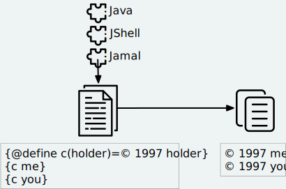

# Jamal

[](https://javadoc.io/doc/com.javax0.jamal/jamal-parent)

Jamal Macro Language

Jamal is a complex text processor with a wide variety of possible use. The first version of Jamal was developed 20 years
ago in Perl. It was used in many projects to simplify build-scripts maintenance, content text, and many other things.
This version of Jamal is a complete rewrite of the original processor in Java. Jamal leverages on the programming
language's features and the twenty years of experience of using the old version. In this documentation, the term "Jamal"
refers to the Java implementation of the macro language.



Jamal's basic concept is to transform a source text to a target text enabling programmatic constructs in the source
text. That way, it enables the maintainer of the text to eliminate

* repetitions,

* calculable text, and

* other redundancies that make a text less readable and more error-prone to maintain.

Jamal design is to be transparent and applicable to any target text file and format. Jamal can create your file from a
Jamal source file no matter any particular need to keep new lines, spacing, or special characters. That way, Jamal can
be applied as a universal, programmable preprocessor to any text file type. The types include document formats, like
Markdown, AsciiDoc, HTML, and textual data description formats, like JSON, YAML, XML, or even programming languages.

The source text can

* use built-in macros (there is a purposefully limited number of them),

* define and used previously defined user-defined macros,

* include files,

* use custom-made macros.

You can start Jamal processing

* from the command line,

* it is available as a Maven plugin, and

* can be embedded into applications using a simple API.

You can extend the set of built-in macros creating new macros in any JVM language and providing the implementation via
the standard Java service loader facility.

Jamal is a text to text processor. It is also a templating engine to maintain redundant text files. During development,
there are often text files that you need to maintain, which contain redundant information.

* Some property or other resource files in a Java project may be slightly different for the different environments, test
  support, user acceptance test, production.

* A textual documentation has cross-references, but the format does not support automatic symbolic anchors and
  references.

* There can be some makefile or other script or documentation file that differs only slightly for the different
  platforms.

* If you have any other use, please tell us.

Generally, Jamal reads a text and generates another one. In the source file, it processes macros, and the result gets in
the macros' place. That way, text, and macros are mixed conveniently.

You can use Jamal as a maven plugin. Some of the Java::Geci code generators also use Jamal. You can use it as an
embeddable macro engine in your Java application.

In this readme, we first discuss how the macros look and how Jamal will convert its input to the output. Then we discuss
the API that lets you embed the macro processing into your application.

## Table of contents

1. [Starting Jamal](#Starting)
1. [Simple Example](#SimpleExample)
1. [Other Macros](#OtherMacros)
    1. [`comment`](#comment)
    1. [`block`](#block)
    1. [`begin` and `end`](#begin)
    1. [`define`](#define)
    1. [`eval`](#eval)
    1. [`env`](#env)
    1. [`export`](#export)
    1. [`import`](#import)
    1. [`include`](#include)
    1. [`use`](#use)
    1. [`script`](#script)
    1. [`sep`](#sep)
    1. [`for`](#for)
    1. [`if`](#if)
    1. [`ident`](#ident)
    1. [`verbatim`](#verbatim)
    1. [`options`](#options)
    1. [`try`](#try)
    1. [Jamal Environment Variables](#JamalENV)
    1. [Jamal API](#JamalAPI)

## Starting Jamal<a name="Starting"/>

### JShell

The simplest way to start Jamal is to use the JShell.

Executing the command

```
jshell https://git.io/jamal
```

(The url above comes from teh URL shortener of GitHub. It redirects
to `https://raw.githubusercontent.com/verhas/jamal/master/jamal-cmd/jamal.jshell`.)

will start jamal to process all files with `.jam` extension in the current directory and below. The output files will
have the same name as the processed file without the `.jam` at the end. For example `pom.xml.jam` will be processed
to `pom.xml`.

You do not even need to install Jamal. If you have Java 9 or later installed you can execute the above command. JShell
will download and execute the script from the url depicted above. The script will check if Jamal is installed on your
machine. If it is not installed it will automatically download the needed JAR. When the JAR files are downloaded it will
start Jamal in the current working directory using the default settings. The settings can be altered using
the `jamal.opotions` file. If this file does not exist in the current working directory then the JShell script will
create one containing the default settings.

### Maven Plugin

It is also very simple to startr Jamal using the Maven plugin version. To do that, you have to have Maven installed, but
as a Java developer, you probably have. Then you can issue the command

```
mvn com.javax0.jamal:jamal-maven-plugin:1.0.2:jamal
```

if you have a `pom.xml` file in your directory. If you do not then read the documentation of the Jamal Maven plugin at
https://github.com/verhas/jamal/blob/master/jamal-maven-plugin/README.md
It is simple and short.

When something goes wrong then Jamal will give you a detailed error message. The message will include the file name,
line number, and character count where the error happened. In other cases, Jamal may think it works fine, but the output
is not exactly what you expected. Sorry, in this case, the issue, most probably, is with your expectations. In cases
like that, you can specify

```
-Djamal.trace=tracefile.xml
```

on the command line that starts Jamal. It will specify a trace file, in this case, `tracefile.xml`. If it is more
convenient, you can also specify the trace file using the environment variable:

```
export JAMAL_TRACE=tracefile.xml
``` 

Only if the `jamal.trace` system property is not defined. When the system property is defined, then the environment
variable is ignored.

The trace file will contain all the macro evaluations' inputs and outputs. Since there can be many Jamal evaluations one
after the other, Jamal does not overwrite old trace information, but rather, it appends the info. Before starting Jamal,
you can manually delete the trace file. Trace files grow large quickly. If you do not want to trace anymore, do not
forget to unset the environment variable typing

```
unset JAMAL_TRACE
```

to avoid an excessively large trace file growing on your disk.

If you use Java 8, you should use it with the release `1.0.2.JDK8`.

## Simple Example<a name="SimpleExample"/>

As a quick sample to have a jump start what Jamal can do:

```jam
{@define fruit(color,actualSize,name)=we have an color name of size actualSize}
{fruit/red/apple/20ounce}
{fruit/green/melon/1kg}
```

will be converted by Jamal to the file

```jam

we have an red 20ounce of size apple
we have an green 1kg of size melon
```

In this sample, the built-in macro `define` is used to define a so-called user-defined macro `fruit`. This macro has
three arguments named `color`, `actualSize`, and `name`. When the user-defined macro is in use, the actual values
replace these arguments.

Note that the macros open with the `{` character and close with the `}` character in this example. These are not
hardwired in Jamal and there is not even a suggested default for that. The embedding application has to define the
opening string and the closing string. For example, the embedding Java::Geci application uses `{{` and `}}` as macro
open and macro close strings. It does it because the `{` and `}` characters frequently appear in the Java source code.
On the other hand, Java code rarely uses the double `{{` or `}}` format. In this documentation, we use the `{` and `}`
strings. However, you have to be aware that this is NOT enforced. This is not even a recommendation or a convention. You
can specify the macro opening and closing string as the program parameter, and the Jamal source code can also change it.
You can change them using the built-in `sep` macro (see later) in the Jamal source.

There is one exception where Jamal uses `{` and `}` as a hardwired strings for macro opening and closing. This exception
was implemented in version 1.5.0 and later. When you import a file into your code and the imported file starts with the
characters `{@` then the import will use `{` and `}`. This way you can easily import files which come from an external
sources, like a JAR file or via the web. The package that defines an import file can use the `{` and `}` characters.
Even if your Jamal file uses different macro opening and closing strings you do not need to chage it to `{` and `}`. You
just write `((@import res:MyResource.jim))`, as an example and it still will be imported properly.

The parameters are separated using the first non-space character following the macro's name in the macro use. Thus, you
can write

```jam
{fruit/red/apple/20ounce}
{fruit|red|apple|20ounce}
{fruit.red.apple.20ounce}
{fruit :red:apple:20ounce}
```

Note that in the last example, we used the `:` character as the separator. Since this character can also be part of the
macro's name, there must be a space before it. Note: When the name of a macro contains one or more  `:` characters, then
the macro is global.

## Other Macros<a name="OtherMacros"/>

`define` is not the only built-in macro in Jamal. The comprehensive list of built-in macros are

* `comment`, `block`
* `begin` and `end`
* `define`
* `eval`
* `export`
* `import`
* `include`
* `script`
* `sep`
* `for`
* `use`
* `if`
* `ident`
* `verbatim`, and
* `options`

You use the built-in macros with `#` or `@` in front of the macro's name. These characters signal that the macro is not
user-defined but built-in, and they also have a side effect. The typical use is to start a macro with the `@` character.
In that case, the macro evaluates the rest of the input till the closing string. If the macro starts with the `#`
character, then the input is first parsed for other macros. These macros are evaluated, and their results replace their
occurrences in the code. Only after this, the macro we are looking at is evaluated. For more details, see the section
about the built-in macro `export`.

### `comment`<a name="comment"/>

since 1.0.0 (core)

`comment` is used to insert comments to the input. It can also be used to enclose definitions without side effects, but
this is not recommended. For that purpose, use the [`block`](#block) macro. For more about definition scopes and
exporting, read the section about `export`.

```jam
this is some {@comment this text
will not appear in the output}text
```

will generate

```jam
this is some text
```

Note that this is important to use the `@` character in front of the keyword `comment` to make is a real comment. If the
macro character `#` is used, like `{#comment comment_text}` then the `comment_text` part will be evaluated. If there is
some macro in the `comment_text` that modifies the evaluation state, then the modification will happen. For example, if
the `comment_text` defines some global macro, then the defined macro can be used after the `comment` block.

It is safe to say always to use `{@comment ...}`. When the code needs the evaluation, then use the [`block`](#block)
macro.

### `block`<a name="block"/>

since 1.0.0 (core)

`block` is technically the same as `comment`. It is recommended to use the `comment` macro with the `@` starting
character. In that case the content of the comment is not interpreted by Jamal. Use the `block` with `#` to have the
content interpreted. Block should be used to enclose definitions to a scope level.

For more about definition scopes and exporting, read the section about [`export`](#export).

### `begin`<a name="begin"/> and `end`

since 1.0.0 (core)

The macros `begin` and `end` start and finish a local definition scope. The effect is practically the same as having the
text inside a `#block` macro. Note, the starting `#` character. It means that the text will be evaluated before the
macro itself is executed.

It is recommended to use `begin` and `end` when the structure is complex, and it is more readable to use the `begin`
/ `end` macros than a simple `block`. To ensure that all `begin` has an `end` you can name the blocks. You can put an
arbitrary string after the macro name `begin` and if you do then you have to repeat the same string after the macro
name `end`. The spaces from the beginning, and the end of the parameter are trimmed.

 ```jam
 {@define Z=1}
 {@begin alma}
    {@define Z=2}{Z}
    {@define S=2}{@export S}
 {@end alma }{Z}{S}
 ```

Scopes are opened by many things, like macro start, or including a file. You can close a scope using the macro `end`
that was opened with a matching `begin`. You cannot and should not close a scope using `end` that was opened by
something else. For example, you cannot get into the scope of the including file putting a pair-less `end` macro into
the included file. This will trigger a processing error.

### `define`<a name="define"/>

since 1.0.0 (core)

`define` defines a user-defined macro in the current scope. Scopes are explained in the section about `export`. The
syntax is

```jam
define id(arguments)=body
```

The arguments part is optional in case there are no arguments for the macro. You can define a zero arguments macro
as `{@define z=content}` or `{@define z()=content}`. The two definitions are equivalent. When the macro is used, the
arguments are replaced in the body by the actual parameters supplied at the place of use. The arguments are specified as
a comma-separated list. They are usually identifiers.

Note that the arguments do not have any special syntax. The only requirement is that they do not contain a comma `,` and
a closing parenthesis `)`. That is because the list is comma-separated, and because `)` terminates the list of the
arguments. It is recommended, though, to use normal identifiers and no spaces in the argument names. This is only a
recommendation and is not enforced by Jamal. You may need to process some special text. You may need some specially
named arguments. Who knows? In the examples, you usually see that the arguments start with a `$` character.

Somebody may follow other conventions, like starting every argument with the `*` or enclosing the argument names
between `|` or `/` or some other characters. These practices can be absolutely okay so long as long they support the
readability of the macro body and the use of the macro. Applying such practices may help to visually separate the macro
arguments from the textual content of the macro body.

From practice, we see that in case of longer macros using simple, argument names with one or only a few letters may lead
to some error. For example:

```
{@define fox(x)=The brown fox jumps over the high x}{fox fence}
```

will result

```
The brown fofence jumps over the high fence
```

This is probably not the result that the macro creator wanted.

To ensure that the argument replacing is consistent and possible to follow the argument names cannot contain each other
as a substring. Assume that there is an argument `a` with an actual parameter value `oneA`. There is another argument
named `aa` with an actual value `twoAs`. In this case the occurrences of `aa` in the body could be replaced to `twoAs`
or `oneAoneA`. Although Jamal could defined some rule, like left-to-right, or right-to-left, or longer-first evaluation
these could still lead to hard to read situations. To avoid that Jamal does not allow you `a` and `aa` as argument names
to the same macro definition.

During the replacement a parameter may be a string that contains the name of one or more argument names. This is
absolutely legit. These will not be replaced with the parameter value(s) that were provided for the other argument(s)
that are inside the value of the parameter. For example:

```
{@define z=(*a,*b,*c,*d)=When a *a can *b then *c can *d}
{z /leopard and a *c/run/fish/fly}
```

will result

```

When a leopard and a *c can run then fish can fly
```

even though `*c` is a `fish` but the characters `*c` in the output come from the value of a parameter and therefore it
is not replaced.

It is possible to use a question mark `?` after the macro keyword `define`. In that case the macro is only defined if is
NOT yet defined in the current scope or any other larger scope.

When the name of the macro contains at least one colon character `:` then the macro will be defined in the global scope.
Global scope is the top-level scope, and it means that a macro like that can be used everywhere in the text after it was
defined.

It is also possible to define a user-defined macro to be global without `:` in the name. If the very first character of
the name of the macro is `:` then this character is removed, and the macro is defined in the global scope.

When a user-defined macro is used, the parameters are defined after the name of the macro. In the case of user-defined
macros, there is no `@` or `#` in front of the name of the macro. Optionally there may be a `?` character before the
macro name. In that case, the result of an undefined user macro will be the empty string. Any other use of an undefined
user macro results an error.

The parameters stand after the name of the macro separated by a separator character. The first non-whitespace character
after the name of the macro is the separator character. It is usually `/` as in the examples below, but it can be any
non-alphanumeric character. The number of parameters should be exactly the same as the number of argument unless
the `{@options lenient}` was specified. In that case, the missing arguments will be zero-length strings, and the extra
parameters will be ignored.

The separator character must not be an alphanumeric character (letter or digit, Unicode categories Lu, Ll, Lt, Lm, Lo,
and Nd). Any other Unicode character can be used as a parameter separator character.

If the user-defined macro has exactly one argument then there is no need to use a separator character. The sole
parameter of the macro can start after the name of the macro at the first non-whitespace character. For example,

```
{@define enclose(a)=<||a||>}
{enclose this text}
``` 

will result `<||this text||>`. The parameter should start with an alphanumeric character or with a macro start string.
If it starts with something else then that character will be a separator character that separates the parameters. In
this case, because there is only one parameter it will separate the macro name from the parameter. For example,

```
{@define enclose(a)=<||a||>}
{enclose /-}
``` 

will result `<||-||>`. Writing `{enclose -}` would result `<||||>` because `-` is not alphanumeric and therefore it is
treated as a separator character.

```
{@define enclose(a)=<||a||>}
{@define dash=-}
{enclose {dash}}
``` 

will result `<||-||>`. This is because the `{` in this case is the macro start string. Because of that, the first
character of it is not considered to be as a separator character even though it is not alphanumeric.

There are cases when it is necessary to use a separator character. In some cases the parameter starts with a significant
space. In other cases it starts with a character that is not alphanumeric. In that case the above macro should be used
like the following three examples:

```
{enclose |+this text}
{enclose ||this text}
{enclose | this text}
```

These uses of the above macro will result

```
<||+this text||>
<|||this text||>
<|| this text||>
```

In the second line in the examples, the separator character is used in the parameter. Because the macro needs only one
argument all the rest of the parameter until the macro closing character is used as the single parameter. It is not
split up further along the later occurrences of the separator character. Just use any non-alphanumeric character in
front of the parameter that looks good. You need not worry that the character itself presents in the content.

There are situations where the use of a separator character is not a must, but the use of it helps the readability.
Consider, for example `{enclose/a/b/v}`. We know that `enclose` from the above has only one argument, but the use of it
looks like it has three. The one argument it has is `a/b/v`.

Omitting the separator character, `/` in this case, does not help the readability. The use `{enclose a/b/c}` still looks
like a macro with three parameters. In situations like that the most readable solution is to use an explicit separator
character that looks good. For example `{enclose |a/b/c}` makes it evident and readable that there is only one
parameter: `a/b/c`.

In the following sample code, you can see some complex examples that demonstrate these cases:

```jam
{@define parameterless=this is a simple macro} macro defined
{parameterless}
{@define withparams(a,b,%66h)=this is a b %66h} macro defined
{withparams/A/more complex/macro}
{withparams/%66h/%66h/zazu} <- %66h is not replaced to zazu in the parameters
{@define? withparams(a,b,c)=abc}here 'withparams' is not redefined
{withparams|a|b|c}
{#comment {@define x=local}{@define :x=global} {#define :y=here we are {x}}}
{y}
here we are {x}
```

will generate

```jam
 macro defined
this is a simple macro
 macro defined
this is A more complex macro
this is %66h %66h zazu <- %66h is not replaced to zazu in the parameters
here 'withparams' is not redefined
this is a b c

here we are local
here we are global
```

This is a fairly complex example. To ease the understanding note the followings:

1. `%66h` is an absolutely valid macro parameter name
1. When a macro parameter is replaced in the body of the macro the processing of that string is finished and is not
   processed further replacing macro parameters. Macro parameters are only replaced with the actual values in the macro
   body and not in the parameter actual values. That is why parameters `a` and `b` are replaced with the actual string '
   %66h' but then this is not replaced with the actual value of the parameter `%66h`.
1. When we define the macros `x` and `y` inside the `comment` macro it happens in a local scope of the `comment` macro.
   It means that the definition of `x` has no effect outside the macro `comment`. Using the name `:x` defines the
   macro `x` in the global scope, that is above the current scope. When we defined the macro `y` it also starts with `:`
   and so it gets into the global scope. However, during the definition, it is in the local scope of the `comment` macro
   where the local definition of `x` overrides the global definition of `x` even though the global definition happened
   later. Therefore `y` will be `here we are local`. That is also because  `y` is defined using the `#` character before
   the built-in macro keyword `define` and thus the content of the definition is evaluated before defining the
   global `y`.

### `eval`<a name="eval"/>

since 1.0.0 (core)

`eval` interprets the content of the macro. The text written after the macro keyword `eval` is evaluated using the
syntax defined as script type after a `/` character. If there is no script type defined (or `jamal` is defined) then the
content will be evaluated as normal Jamal macro text. Otherwise, the script engine named is used.

The syntax of the macro is

```jam
eval macro text
```

or

```jam
eval/scripttype script
```

If `eval` is followed by `/` character then the next identifier is the type of the script. You can use any scripting
language that

* implements the Java scripting API and
* the interpreter is available on the classpath when Jamal is executed.

If the script type is `jamal` then it is the same as there was no script type specified. The explicit specification that
the content is a Jamal source may be necessary when the content of the macro to be evaluated starts with the `/`
character.

The following two examples show how `eval` can be used to evaluate simple arithmetic expressions using the Java built-in
JavaScript interpreter. Note that in the second example the macro `eval` is preceded with the character `#` therefore
the body of the macro is parsed for other macros before `eval` itself is invoked. That way `{a}` and `{b}` are replaced
with their defined values and `eval` itself sees `1+2`.

```jam
{@eval/JavaScript 1+3}
{@define a=1}{@define b=2}
{#eval/JavaScript {a}+{b}}
```

```jam
4

3
```

Starting with version 1.5.0 Jamal introduces the `!` modification character. When this character is used in front of a
macro, then the result of the macro will be evaluated like it was surrounded with `{@eval ... }`. This can be used in
the case of user-defined macros as well as in the case of built-in macros. Note, that in the case of user-defined macros
the result of the macro will be evaluated by default. Using the `!` in front of the macro will repeat the evaluation.
You can use more than one `!` characters in front of a macro use. The macro result will be evaluated so many times as
many `!` characters there are. In case of a user-defined macro the "so many times" should be interpreted as one, by
default plus N times. For example:

```jam
{!!userDefined}
```

will get the value of the macro `userDefined` and evaluates it three times.

You can use this character together with the back-tick macro modifying character. When using `!` to evaluate the result
of a macro you cannot specify any scripting language. The evaluation will be Jamal macros evaluation.

### `env`<a name="env"/>

since 1.3.0

`env` returns the value of an environment variable. The macro can also be used to test that an environment variable
exists or not. If the argument to the macro is the name of an environment variable then the result will be the value of
the variable. If the variable is not defined then the macro will result empty string.

If there is a `?` after the name of the variable name then the macro will result either the `true` or `false`. This can
be used to test that an environment variable exists or not. Testing the value of the environment variable in
an `{@if ... }` macro may be misleading when the value is literal `false` or an empty string.

### `import`<a name="import"/>

since 1.0.0 (core)

`import` opens a file and reads the content of the file and interprets it as Jamal macro file. Anything defined in that
file will be imported into the scope of the current file. If the macro opening and closing strings are redefined using
the `sep` macro it will change for the file that imported the other file. Any user-defined macros defined in the
top-level scope of the file will be available in the importing file.

Note that the top-level scope of the file may not be the same as the global scope. If the importing happens

* from an included file, or
* from inside a block of from inside a macro, or
* in scope that was started with a `begin` macro

then the "top-level-scope of the file" is the one, that contains the `import` macro. If anything is defined into the
global scope in the imported file then those macros will eventually be in the global scope and available to anyone
later.

The output that the processing of the imported file generates is discarded.

The syntax of the command is

`import file_name`

The name of the file can be absolute, or it can be relative to the file that imports the other file. Any file name
starting with the letters `res:` are considered to be resource files in Java. This makes it possible to load macros that
are provided with JAR libraries and are on the classpath. Any file name starting with the letters `https:` are
downloaded from the net.

Use `import` to import user-defined macro definitions.

Because the textual output from the evaluation of the file is discarded feel free to use text in the file to be imported
as documentation. There is no need to enclose such a text into a `{@comment ...}` macro.

Starting with version 1.5.0 the import macro looks into the file before evaluating it. If the very first two characters
in the file are `{@` then it evaluates the content using `{` as macro opening string and `}` as macro closing string.
This way you can freely import resource files provided in JAR file or through the net even if you use different macro
opening and closing strings.

### `include`<a name="include"/>

since 1.0.0 (core)

`include` reads a file similarly to `import` but it starts a new scope for the processing of the included file and it
also results the content of the file included into the main file.

Use `include` to get the content of a file, and into the main output.

The file included can define user-defined macros for the file including only if the macro is exported from the top-level
scope of the included file. The included file may redefine the macro opening and closing string, but this works only in
the included file only. The file that inclues the other file is not affected by the redefinition of the macro opening
and closing string.

The macro itself is replaced by the output generated by the processing of the included file.

The syntax of the command is

`include file_name`

The name of the file can be absolute, or it can be relative to the file that includes the other file. Any file name
starting with the letters `res:` are considered to be resource files in Java. This makes it possible to include files
that are provided with JAR libraries and are on the classpath. Any file name starting with the letters `https:` are
downloaded from the net.

The number of includes are limited to 100 in depth. A file can include another, which can again include another and so
on, but only to the maximum depth of 100. This depth limit is set because an included file can be included many times
and this makes it possible to implement recursive including of files. If the recursion does not end the include
macros will drive the macro resolution into an infinite loop. This limit prevents this to happen.

### `use` <a name="use"/>

`use` declares a Java class as a built-in macro.

Built-in macros are classes that implement the `javax0.jamal.api.Macro` interface. When they are registered as services,
they are automatically loaded when any application embedding Jamal creates a new processor. In other words, the classes
that implement some macro are automatically discovered if

* they are in the `module-info` module descriptor `provides` directive and/or
* the fully qualified name of the class is listed in the JAR file in the  `META-INF/services/javax0.jamal.api.Macro`
  file.

Some libraries contain `javax0.jamal.api.Macro` implementations that are not loaded by the service loader. These classes
are not advertised in the `module-info` file or in the `META-INF` directory. To use these classes as built-in macros the
macro `use` has to be invoked.

The use of the `use` macro (sic) is the following:

```
{@use global javax0.jamal.scriptbasic.Basic as scriptbasic}
```

In this example, the class `javax0.jamal.scriptbasic.Basic` implements a macro. It will be defined and available as a
globally available built-in macro under the alias `scriptbasic`.

The keyword `global` can be missed:

```
{@use javax0.jamal.scriptbasic.Basic as scriptbasic}
```

In this case, the macro will only be available in the current scope and will not be available as soon as the current
scope is closed. Note that built-in macros cannot be exported. They can be declared either local for the current scope
or global.

Usually, the alias part (the `as scriptbasic` in the example above) can also be omitted:

```
{@use javax0.jamal.scriptbasic.Basic}
```

In such a case the macro will be registered with the name that the macro provides by itself as an identifier. The
interface `Macro` defines a method `String getId()` that should return the identifier of the macro. The interface also
provides a default implementation that returns the lower-case version of the class name (w/o the packages). If there is
no defined alias following the `as` keyword then the one returned by the macro implementation will be used.

It is recommended to use the alias in the Jamal source file. That way there is no ambiguity when reading the code what
the name of the built-in macro is.

### `script`<a name="script"/>

since 1.0.0 (core)

The macro `script` defines a user-defined macro that is interpreted as a script. The syntax of the command is

```jam
script/scripttype id(parameters)=body
```

If `script` is followed by `/` character then the next identifier is the type of the script. If this is missing the
default, `JShell` is assumed. You can use any scripting language that implements the Java scripting API and the
interpreter is available on the classpath when Jamal is executed.

The parameters are handled differently from the parameters of the user-defined macros defined using the `define`
built-in macro. In that case, the parameter strings are replaced by the actual value strings during evaluation. In this
case, the parameters are used as global variable names. Using these names, the actual values are injected into the
context of the script before evaluation.

This also implies that you do not have the total freedom of parameter names that you had for user-defined macros defined
using the built-in macro `define`. There we can use there any string as a parameter id so long as long it contains no
comma and closing parenthesis. In this case, you should care about the syntax of the scripting language used. The
parameter names have to be valid identifiers in the scripting language as they are used as such.

The value injection converts the actual value of the parameter to script values. Because in this case the values are not
injected into the macro body as string replacement but rather assigned to global variables in the script some conversion
should take place. Without this, all the scripts that use some integer or floating-point numbers were supposed to
convert them first from the string.

Therefore, Jamal tries to convert the actual parameters.

* First it tries treating it as an integer. If it succeeds then the global variable having the name as the parameter
  will hold an integer value.

* If the conversion to an integer does not work then it tries the same with double.

* If that is also not feasible then it will check is the actual value is lower case `true` or `false`. In this case the
  global variable of the script will be a `Boolean` value.

* In any other case, the global variable will get the actual value as a string assigned to it.

The actual scripting implementation may not have `Integer`, `Double` or `Boolean` type but there will be some script
type corresponding.

The following sample shows a simple script that implements a looping construct using JavaScript. The source Jamal file:

```jam
{@script for(loopvar,start,end,text)=
    c = ""
    for( i = start ; i <= end ; i++ ){
      c = c + text.replace(new RegExp( loopvar , 'g'), i)
    }
    c
}
{for%xxx%1%3%xxx. iterated
}
```

The output generated by the Jamal preprocessor:

```jam

1. iterated
2. iterated
3. iterated

```

Note that the JavaScript code itself contains the macro opening and closing strings. This does not do any harm so long
as long these are in pairs. It is a better practice to change the separator characters to something that cannot appear
in the body of the script macro.

Starting with version 1.3.0 Jamal support the JShell built-in scripting engine. You can define `JShell` as script type.
In this case the content will be passed to the Java built-in JShell engine. When the script is invoked the result of the
macro will be the string that is printed by the JShell script. If this is empty then the value of the last Java shell
snippet will be used. The argument names have to be valid Java identifiers. When the script is invoked they will be
defined as `String`, `long`, `double` or `boolean` variables and they will get the actual values of the parameters. The
type depends on the actual value. If the value string can be interpreted as a `long` then it will be converted to `long`
. If the string is not a long, but can be converted to `double` then the variable will be `double`. If the string is
either `true` or `false` case insensitive then the variable will be `boolean`. In any other case the variable will be
declared as `String`. For more information and details see the section [`JShell`](#JShell).

### `JShell`<a name="JShell"/>

since 1.3.0 (core)

The Java built-in scripting engine JShell can be used to define macros. The macro [`script`](#script) and the
macro `JShell` can be used to define JShell scripts.

The macro `JShell` can be used to define methods, classes, variables and so on. The macro [`script`](#script) is to
define a script macro that later can be invoked like any other used defined script macro.

When the macro `JShell` or [`script`](#script) is used the result is empty string. When the script is invoked the output
of the macro will be what the script prints out to the standard output.

The following example defines a global method, a script using the method and then it invokes the script.

```
{@JShell
    void hello(){
        System.out.println("Hello, " + world);
    }
}{@script hello/JShell(world)=hello();}
{hello My Dear}
```

The macro `JShell` defines the method `hello()`. The macro `script` is a script macro that has one argument. Note that
this argument is also the name of the global variable `world`. This global variable is used in the JShell snippet
defined above but this is not an argument to the method. When we use the line

```
{hello My Dear}
```

Jamal will invoke the JShell interpreter executing

```
String world = "My Dear";
```

first, and then

```
hello();
```

Since the method `hello()` prints out to the standard output `Hello, My Dear` this is the result of this macro.

If there is some error in the code of the snippet then Jamal will throw a `BadSyntax` exception. In this exception the
causing exception is included if there is any. This causing exception should give some clue to find out what the issue
is. If that does not help then using the interactive JShell program should help.

Creating a JShell execution environment is expensive. To do that the JVM process starts a new process for the JShell.
Many Jamal macro processing do not need the extra JShell. It would slow down Jamal if we created the JShell process for
each and every processor even when it is not needed. The JShell environment is created only when it is unavoidable. It
is when the processing uses the first time a JShell type script. It not when the script is defined.exampleIt is when the
defined script is used. In the above example the JShell interpreter is created when the `{hello ...}` is evaluated. Only
at that point all the prior definitions that were defined in any `{@JShell }` macro are fed into the JShell interpreter.

The consequence is that you do not need to worry about the performance when you design a macro library. The processed
files can bravely import the macros even if they declare JShell usage. It will not slow down the processing creating a
JShell engine, only when the JShell engine is needed.

Another important side effect of this optimization is that you will not get an error message for an
erroneous `{@JShell }` macro only when the JShell interpreter is used. When you design a macro libraray it is not enough
to import the library to discover possible errors in the JShell scrips. The scripts have to be used to manifest the
error.

### `for`<a name="for"/>

since 1.0.0 (core)
since 1.5.0 multi-argument `for`

The macro `for` can be used to repeat the same text many times. This macro has two forms. The syntax of the macro is
either

```jam
{@for variable in (a,b,c,d)= content to be repeated
containing variable}
```

or

```jam
{@for (v1,v2,v3) in (a|w|1,b|q|2,c|r|5,d|t|9)= content to be repeated
containing v1 v2 and v3}
```

The `variable` or the multiple variables can be used in the content and will be replaced for each iteration with the
respective element on the comma-separated list. When there are multiple variables then the sub-list is separated using
the `|` character. Both the command and the `|` character can be modified to use something else instead of these
characters.

The list of the values can also be separated by other strings. If the macro `$forsep` is defined, like in

```jam
{@define $forsep=\s+}
```

then the arguments will be separated by one or more spaces. The string between the `(` and the `)` will be split using
the string defined in `$forsep` as a regular expression.

Similarly, if the macro `$forsubsep` is defined, like in

```jam
{@define $forsubsep=:}
```

then the values for the different variables will be separated by a semicolon.

Note that the macros `$forsep` and `$forsubsep` can also be defined inside the `for` macro body in case the macro is
used with the `#` character at the start. In this case the definition of these macros is limited to the evaluation of
this very `for` macro.

For example the macros:

```
{#for $a in (a:b:c)={@define $forsep=:}a is $a
}{?$forsep}
```

will result

```
a is a
a is b
a is c
```

The value of the macro `$forsep` is effective inside the `for` but it is undefined outside.

If the number of the actual values separated by `|` character is not the same as the number of the variables in the for
loop then the macro evaluation will throw a bad syntax exception. This can be suppressed with the option `lenient`. If
the option lenient is used then extra values are ignored and missing values are presented as empty strings.

Starting with version 1.5.3 you can fine tune how a `for` loop treats the empty elements. By default, the empty elements
in a foor loop value list represent empty strings. The loop body will be rendered with these values replacing the loop
variable with an empty string. In a situation like that the use of the option `lenient` is also a must if the loop has
multiple variables. In that case the empty value will be split into a one, empty string value for the empty value in the
loop and this has to be assigned to the multipled loop variables. For example

```jamal
{#for (k,z) in ()=wukz}
```

will not work, because the empty string cannot be split into two strings (it results one empty string when it is split).
On the other hand the following code will work

```jamal
{#for (k,z) in ()=wukz{@options lenient}}
```

and it will result

```text
wu
```

as both `k` and `z` are empty strings.

This default behaviour can be altered using the option `skipForEmpty`. If this option is used the `for` loop will skip
the empty values. The previous example with this option:

```jamal
{#for (k,z) in ()=wukz{@options skipForEmpty}}
```

will evaluate to an empty string. Also note that in this case there is no need to use the option `lenient` because the
empty value is skipped and there is no issue splitting it up.

The example above contains one loop value and that loop value is an empty string. There can be more than one empty
values in a for loop and empty and non-empty values can be mixed. The option `skipForEmpty` works in any of those cases.
For example:

```jamal
{#for k in (,)=wuk{@options skipForEmpty}}
```

will result an empty string and

```jamal
{#for k in (,k)=wuk{@options skipForEmpty}}
```

will result

```text
wuk
```

### `if`<a name="if"/>

The `if` macro makes it possible to evaluate the content conditionally. The syntax of the macro is:

```jam
{#if/test/then content/else content}
```

Here we use `/` as a separator character but this is not hardwired. Any other character can be used that does not appear
in the `test` text and in the `then content` text. The first non-space character following the macro keyword `if` will
be used as a separator character.

The result of the evaluated macro will be the `then content` when the `test` is true and the `else` content otherwise.
The `test` is true, if

* it is the literal string `true` (case-insensitive),

* it is an integer number, and the value is not zero or

* it is any other string that contains at least one non-space character, except

* when the `test` is the literal string `false` (case-insensitive) then the test is false.

In the following examples the string before and after the `=` will be the same in the output:

```
true={@if /1/true/false}               <- non-zero integer
true={@if /true/true/false}            <- literal true
false={@if /0/true/false}              <- zero integer
false={@if ::true:false}               <- condition is empty string
false={@if :false:true:false}          <- literal false
true={@if :avraka kedabra:true:false}  <- condition is non-empty string
False={@if false fFalse fTrue}         <- separator character is 'f'
                                          condition is 'alse ', non-empty string
={@if/0/anything can come here}        <- "else" part is missing, output is empty
true={@if/+1/true}                     <- non-zero integer
true={@if/-1/true}                     <- non-zero integer
true={@if/0.000/true}                  <- non-epmty string, floating points dont work
```

### `ident`<a name="ident"/>

since 1.0.0 (core)

`ident` is an extremely simple macro. It just returns the body of the macro. The name stands for _identity_. It is
useful in some complex cases when the evaluation order of the macros need to be fine tuned. This is the case when some
macro should not be evaluated but others should during the definition of a user-defined macro. For example:

```jam
{@define b=92}{#define c={@ident {a}}{b}}{@define a=14}{c}
```

When we define the macro `c` we do not want to evaluate `{a}`. There are two reasons for this. One is that at that
point `a` is not defined. The other is that we want to use the actual definition of `a` whenever the macro `c` is used.
On the other hand we want to evaluate `b`. This way `c` will become `{a}92`. When later `c` is used and `a` is already
defined being `14` then the final result will be `1492`.

```jam
1492
```

Note that `c` is defined using the `#` character in front of `define`. At the same time we used `@` in front of `ident`.
The content of the `define` is evaluated. In this evaluation `{@ident {a}}` is evaluated and `{b}` is also evaluated.
`{@ident {a}}` becomes `{a}`.
`{b}` becomes '92`. This way `c` will become `{a}92`.

If we redefine later `a` to some different value then `c` will follow this change. If we redefine `b` the value of `c`
will still remain `1492` assuming `a` is still `14`.

You can also use this macro to enclose some text into a block where you can have the definitions local. For example, you
may want to modify the macro start and end strings temporarily. In that case, you can use the `sep` macro at the start
and use the `sep` macro without argument to reset the previous value. You can also enclose the setting of the macro
start and end string into an `ident` block.

A special use of `ident` is to insert a "null length separator" into the text. Imagine that the macro start and close
strings are set to be `((` and `))`. We may want to use those because the curly braces are used in the text frequently
and so are the single `(` and `(` characters. As an example we may want to define a macro that creates a markdown image
reference:

```text
((@define image($ref)= ))
``` 

This example needs a space after the cosing `)` character at the end of the image url. If we did not have this space the
macro would be closed one `)` sooner than needed. This solution inserts an extra space after the image reference.
Usually it is not a problem. In some situations, however, we do not want to have that extra space there. This is
possible using `ident`.

```text
((@define image($ref)=((@ident))))
```

The macro `((@ident))` will prevent Jamal to interpret the `)` character after the `.png` as the first character of a
macro closing string. The same time `((@ident))` produces no character, not even a space in the output. Note
that `comment` or `block` can be used the same way.

Be aware that the macro `ident` consumes the white spaces (including newlines) that follow the `ident` keyword. This is
to avoid extra white spaces when tabulation is needed for better readability. If you need the whitespace (e.g.: newline)
in the output then you have to put those before the `ident` macro.

Starting with Jama 1.5.0 there is a built-in language syntax to have the same effect as `ident`. If a macro is preceded
with a

```
`
```

backtick character then the macro will not be evaluated. The above example can also be written as:

```jam
{@define b=92}{#define c={`a}{b}}{@define a=14}{c}
```

This built-in "ident" can be used many times in case the evaluation of a macro has to be postponed multiple times. You
can have

```jam
{``c}
```

or

```jam
{``````c}
```

as many times as it makes sense. This macro modification character can be used together with the `!` character. There is
no restriction on the ordering on the `!` and the backtick characters in case they are used together. If many of them
are used in an extreme case they can be mixed together. Note, if the macro does not get evaluated fully the order of
these characters may not be preserved in the output.

### `verbatim`<a name="verbatim"/>

since 1.0.0 (core)

`verbatim` is a special macro, which affects macro evaluation order and is used for advanced macro evaluation. To
understand what it does, we have to discuss first how Jamal evaluates the different macros.

Jamal parses the input from the start towards the end and copies the characters from the input to the output. Whenever,
when it sees a macro then it evaluates the macro, and the result of the evaluation is copied to the output. This
evaluation is done in three steps, two of those are recursive. Let's have a simple example:

```jam
{@define a=this is it}{@define b={a}}{#define c={b}}{c}
```

The macro `a` is defined simply. It is `this is it`. Whenever `a` is evaluated it will result the string `this is it`.

The macro `b` has the value `{a}`. When macro `b` is defined the content `{a}` is not evaluated before the definition
because there is a `@` before the `define`. When `b` is evaluated it results `{a}` and then before using this output in
place of the use of the macro `b` this result is evaluated by Jamal as a new input. This second recursive evaluation
will result in the string `this is it`.

The macro `c` is defined using the `#` character before the keyword `define`, therefore Jamal will process the body of
the macro before processing the built-in macro `define` itself. Essentially, it will evaluate `{b}` first. It will put
the resulting characters after the `=` sign in the definition of `c` and then it will evaluate the `define` built-in
macro.

As we discussed above when this time `{b}` is evaluated it results `{a}`, which also gets evaluated and then it
results `this is it`. Therefore, the value of the macro `c` is `this is it` and that is what we see in the output:

```jam
this is it
```

This way the evaluation of a macro is done in three steps:

1. Evaluate the body of the macro unless the macro is built-in and starts with the character `@`. When evaluating the
   macros in the body of the macro starts a new scope and evaluate the macros following these three steps.
2. Evaluate the macro itself.
3. If the macro is user-defined or starts with a `!` character then evaluate the output of the macro and if it contains
   macros then evaluate those using these three steps.

As you can see the first, and the last steps are recursive steps. The first step can be skipped using the `@` character,
but only in case of built-in macros. The second step cannot be skipped, and after all, there is no reason to do so.
However, the third step can be

* skipped using the macro `verbatim` if the macro is user defined, or
* enforced using a `!` in front of the `@` or `#` character if the macro is built-in.

The use of the `!` character in front of a built-in macro is similar to the use of the macro `eval`. For example

```jam
{@define tag(_x)={@define _x(_y)=<_x>_y</_x>}}
{#eval {@for _tag in (groupId,artifactId,version)=
{tag/_tag}}}
```

can be shortened as

```jam
{@define tag(_x)={@define _x(_y)=<_x>_y</_x>}}
{!@for _tag in (groupId,artifactId,version)=
{tag/_tag}}
```

The only difference is that the `eval` macro consumes the white-space characters at the start of its argument. In the
example above the `{#eval macro ...}` before its evaluation is

```jam
{#eval
{@define groupId(_y)=<groupId></groupId>}
{@define artifactId(_y)=<artifactId></artifactId>}
{@define version(_y)=<version></version>}}
```

The body starts with a new line. The macro `eval` deletes this new line, while using the `!` in front of the macro does
not.

The syntax of the `verbatim` macro is the following:

```jam
{@verbatim userDefinedMacroUse}
```

The `verbatim` macro has to be followed by a user defined macro usage. If we modify the previous example to
use `verbatim` we can do it the following way:

```jam
{@define a=this is it}{@define b={a}}{#define c={@verbatim b}}{c} {@verbatim c}
```

In this example `{@verbatim b}` is the same as `{b}` in the previous example. The only exception is that after `b` is
evaluated the result is not processed further for macros. It is used directly as the value of the new macro `c` because
of the `verbatim` keyword. The value of `c` will be `{a}`. Also, when we use `{c}` the result of `c` is scanned as a
third step for further macros. In this case, there is one because the value of the macro `c` is `{a}`, that further
evaluates to `this is it`. On the other hand when we use `{@verbatim c}` then the result `{a}` is not processed any
further.

```jam
this is it {a}
```

Note that the macro `verbatim` is a special one because it is hardwired into the evaluation logic of Jamal and it is not
a "real" built-in macro. In other words, if there are user-defined macros and built-in macros then `verbatim` is one
level deeper built-in than the other built-in macros. To understand this may be important if you want to write your own
built-in macros as Java classes. You cannot "redefine" `verbatim`.

You cannot use `verbatim` together with the `!` macro modifying character. Their meaning is exactly opposite.

#### Fine points of macro evaluation

NOTE: This section does not apply to versions prior to 1.2.0

Recall the three steps of macro evaluation:

1. Evaluate the body of the macro unless the macro is built-in and starts with the character `@`. When evaluating the
   macros in the body of the macro starts a new scope and evaluate the macros following these three steps.

2. Evaluate the macro itself.

3. If the macro is user-defined then evaluate the output of the macro and if it contains macros then evaluate those
   using these three steps.

In the case of user-defined macros, the first step is executed in three sub-steps.

1. First the start of the macro is evaluated if it is a macro itself. The user-defined macro name itself in the text can
   be the result of another macro. For example, calling the macro named `white` can be `{white}`. If there is another
   macro `{@define black=white}` then using `{{black}}` will result the same as `{white}`. In this case first `{black}`
   is evaluated to `white` and then `{white}` is evaluated. There may be multiple macros at the start. For example, we
   can have `{@define bla=whi}` and `{@define ck=te}`. Using these we can get `{{bla}{ck}}` to `{white}`.

2. The second step is that the content of the macro is split up into the macro name and the parameters. Recall that the
   first character that is not part of the name of the macro is used as a parameter separator character. This is a
   non-space character that cannot be part of a macro name, or the first character that follows the spaces after the
   macro name. The splitting process takes care of the macro calls that are in the arguments. For example the
   macro `{q/a/{b|c/g}}` will get two parameters. The first parameter to `q` is `a`, the second is `{b|c/g}`. The
   first `/` character separates the name of the macro from the parameters. At the same time, it defines which character
   is used as a separator character. The second `/` character separates the first and second parameters. The third `/`
   is not used as a separator character because it is inside a macro use. This character is not used as a separator
   character, even when the macro `{b|c/g}` is evaluated, because in that macro use the separator character is `|`.
   Similarly, if we look at the macro `{q/a/{b/c}}` then the parameters are `a` and `{b/c}`. In this case, the third `/`
   is ignored and is not considered as a parameter separator. Although this character is a parameter separator when the
   macro `b` is evaluated. The characters that are inside further macro calls are not used as parameter separators.

3. When the parameter strings are identified then they are evaluated one after the other, so that in the previous
   examples `{b|c/g}` or `{b/c}` are evaluated and when the macro `q` is evaluated the parameters already contain the
   result of the evaluation of these macro uses.

The versions of Jamal prior 1.2.0 (so up to and including 1.1.0) evaluated user-defined macros simpler. In those
versions the body of the macro was evaluated as a whole in one simple step. The parameter separator character was used
in a very simple splitting operation. This did not check if the separation character was inside an embedded macro use.

That way it may have happened that some macro was evaluated, and the resulting string contained the separator character.
This is not what usually the users intended, and it is usually a bug that is hard to find. In the previous examples the
evaluation of the macro use `{q/a/{b/c}}` would evaluate first `a/{b/c}`. After that the splitting takes place on the
resulting string. Usually, this results in the same as the new algorithm. However, if the definition of `b` is for
example `{@define b(Z)=shoot/Z`, then the evaluated string will be `a/shoot/c`. In this case the final evaluation will
get (prior 1.2.0) `{q/a/shoot/c}`. It will result in three parameters. This is probably an error because `q` in the
example needs only two. Even if the option `lenient` was declared the result is not the one the author of the text
expected.

The version 1.2.0 and later version can revert to the earlier algorithm is the Jamal code defines the
option `omasalgotm`. Using the macro `options` as `{@options omasalgotm}` you can switch on the old algorithm. The name
of the option is an abbreviation and is hard to remember to distract from the use of it. If you need this option then
your Jamal source file does some shady thing that it should not. This option is obsolete from the very start of the
introduction and is meant as a last resort to keep backward compatibility. It will be removed from Jamal versions 2.0.0
and later.

### `sep`<a name="sep"/>

since 1.0.0 (core)

This macro can be used to change the macro opening and closing string. In the examples, in this documentation, we
use `{` as the opening string and `}` as the closing string. Jamal itself does not impose any such predefined setting.

The syntax of the command is

```jam
sep /startString/endString
```

If both the start and end strings are a single character, for example `[` and `]` then you can use the simple form:

```jam
{@sep []}
```

A two-character argument to the macro `sep` will use the first character as macro opening string and the second as macro
closing string. You can also use three character. For example:

```jam
{@sep [.]}
```

The separating character between the opening and closing string characters can be any character except any of the
opening or closing string character. It is also possible to use the format

```jam
{@sep openingString  \s+   closingString}
```

separating the opening and closing strings with spaces. This format is very readable and convenient in many cases. For
example, you can specify

```jam
{@sep (( )) }
{@sep ([ ]) }
```

and other, similar opening and closing strings. There are some definitions that are misleading. For example, the
following declarations can be interpreted by humans in multiple ways.

```jam
{@sep/[/ ] }   <- is it "/[/" and "]" or "[" and "]"   
{@sep/[ /]}    <- is it "/[" and "/]" or "[" and "]"
``` 

Many human readers would tend to think the second. The syntax however matches the `\S+\s+\S+` pattern. To avoid any such
ambiguous situation Jamal does not allow the use of this form when

* the opening string
    * starts and ends with the same character
    * is at least three characters long and
    * it does not contain the first character inside

or

* the closing string
    * starts with the same character as the opening string
    * at least two character long
    * does not contain this character after the first character.

These seem to be a bit complex rules. They contain a bit of heuristics. They were designed to let the users use the most
readable format of the `sep` macro. The same time they help avoid unreadable declarations and errors.

If in doubt then you can always use the last, definitive syntax that does not rely on any heuristics. This syntax is
described in the followings.

If the syntax does not match and of the previous cases, Jamal will use the "regular expression" like the syntax:

```jam
sep \s* (\S) opening_string (\1) closing_string \s* 
```

There can be whitespace characters after the macro name `sep`, and at the end, but these are optional. The first
non-space character is used as a separator character that separates the macro opening string from the macro closing
string. It is usually the `/` character, but it can be anything that does not appear in the opening string. Prior to
1.3.0 this character could appear in the closing string, although it is not recommended. Starting with 1.3.0 it is an
error. It is possible to use spaces inside the macro opening and closing strings, but it is not recommended. Leading and
trailing spaces of the opening and closing strings will be trimmed off. That way

```jam
{@sep /[[/]]}
{@sep /[[ / ]]}
{@sep /[[ / ]] }
{@sep / [[ / ]] }
``` 

are all the same. Note though that `{@sep /[[ /]]}` would be logical in the above list, but it is missing. There is only
one space (`\s+`) separator between the `/[[` and `/]]` strings, and it matches the

```jam
{@sep openingString  \s+   closingString}
```

format, and it will set the separators to `/[[` and `/]]`.

Note that the macro `sep` should be terminated with the original macro closing string. However, the macros after it
already have to use the altered opening and closing strings. This makes it a bit tricky when you want to use a closing
string that happens to contain the original closing string. Assume that the current opening string is `{` and the
current closing string is `}`. You want to have `{{` as an opening string and `}}` as a closing string. This is often
the choice when using Jamal in a programming language environment that heavily uses `{` and`}` braces. In this case

```
{@sep/{{/}}}
```

will not work. It will set the closing string empty which is not valid and will raise an error. To overcome the
situation you have to change the separator strings in two steps:

```
{@sep/[/]}[@sep/{{/}}]
```

Also, do not forget that the end you should call `sep` without an argument twice:

```
{{@sep}}[@sep]
```

unless you want this change till the end of the scope.

The change of the opening and the closing strings always happens in pairs. You cannot change only the closing or only
the opening string. You can, however, redefined one of them to be something that is different from the current value,
and the other one to be the same as the current value. Doing that you will need two steps for the reason described
above. Even in this case, the definitions should specify both strings. The change is valid only for the current scope.
Returning from the scope the original value is restored even if the strings were set to different values multiple times.

Neither the opening nor the closing string can be empty. Trying to set it to an empty string will raise an error. Note:

* Jamal 1.0.0 got into an infinite loop in case of an empty opening string. Later versions will signal an error.
* Jamal 1.3.0 extended the `sep` macro.

When the opening and the end strings are set the original values are stored in a list. It is possible to use the
macro `sep` without any separator strings. In this case the macro call is nothing more than the `sep` macro name,
like `{@sep}`. In this case the last opening and closing strings are restored. The strings are stored in a stack, so you
can define new strings and return to the previous one many times nesting the redefinitions.

The following sample is executed with `{` and `}` as opening and closing string at the beginning. After that, it sets
the strings to `[[` and `]]`. This is used to define the macro `apple`. After this when the scope of the next
macro, `comment` starts the opening and closing strings are still `[[` and `]]`.  
Starting a new scope does not change the macro opening and closing strings.

It would be an error to use `[[@sep]]` inside the scope of the macro `comment` at this point trying to restore the
original macro opening and closing strings. In that scope at the start, there are no opening and closing strings to be
restored. The opening and closing strings do not belong to this scope, they are simply inherited from the outer scope.
On the other hand, the sample can change the strings, as it does to `<<` and `>>`. Using these it defines the macro `z`.
Note that `z` is not exported from this scope.

After that the `<<@sep>>` restores the opening and closing strings to the inherited one and with these, it defines `a1`
and `a2` and exports them. Note, that `a1` will have the actual value of the macro `z` evaluated inside the scope of
the `comment` macro. The macro `a2` starts with `@` thus the body is not parsed during the macro definition and thus the
value of `a2` is `[[z]]` unevaluated, as it is. Similarly, the macro `a3` will have the value`{z}`.

All these macros are evaluated because the macro `comment` is started with the character `#`. It means that Jamal will
evaluate the body of the macro before evaluating the macro itself.

After the `comment` macro the separators are set back to the original value `{` and `}` automatically. Then we have a
simple macro definition that defines `z` and then this `z` is used, and the exported `a1`, `a2`, and `a3`.

`z` is now, as defined in the outer scope is `SSS`.
`a1` has the value that came from the macro `z` as it was defined inside the scope of the macro `comment`. Macro `a2`
has the value `[[z]]` that has nothing special in the current scope. The macro `a3` has the value `{z}` which is
evaluated after the macro `a3` is replaced with its value.

```jam
{@sep/[[/]]}
[[@define apple=fruit]]
[[apple]]
[[#comment [[@sep/<</>>]]
<<@define z=zazi>>
<<#sep>>
[[#define a1=[[z]]]]
[[@define a2=[[z]]]]
[[@define a3={z}]]
[[@export a1,a2,a3]]
]]
[[@sep]]
{@define z=SSS}
{z}{a1}{a2}{a3}{@verbatim a3}
```

```jam


fruit


SSSzazi[[z]]SSS{z}
```

### `export`<a name="export"/>

since 1.0.0 (core)

`export` moves the definition of one or more user-defined macros to a higher scope. When a macro is defined it is
defined in the current scope (unless the name contains or starts with `:`).

The Jamal input file is one scope and if there is a macro defined in the file on the top-level then that macro can be
used anywhere inside the file. However, when Jamal includes a file into another it opens a new scope. The
macro `include` should include some text in the output. It can be used, for example, to split up a long document into
chapters and then use Jamal to create the final output. In that case, the macros defined in the included files should
not interfere with the definitions in the file that includes the other one. To accomplish this separation Jamal starts a
new scope when it includes a file. Scopes are embedded into each other like a call stack in a programming languages.
When a macro is defined in scope it is available in that scope and all other scopes that are opened from that scope.
When a macro is redefined in a scope the redefined value is used until the scope is closed. In the case of an included
file, the user-defined macros defined in the included file disappear as soon as the included file processing is
finished.

The setting and resetting of the separator characters is also limited to the scope. You cannot reset the separator
character to a value that was set in a lower scope or higher scope.

Jamal opens a new scope in the following cases:

* When a file is processed with the `include` macro.
* When macros are evaluated inside another macro. This is the case of user-defined macros or in case of built-in macros
  when they are started with the character `#`.
* Other built-in macros that are not part of the core package may also start and close scopes. Note that built-in macros
  can be provided in form of JAR files.

Note that the macro `import` does NOT open a new scope to process the imported file. This is because of the aim
of `import` is to have the macros defined in the imported file available in the file that imports them.

In the following example, we define the macro `Z` in the scope of the macro `comment`. The `{@define Z=13}` is evaluated
before the `comment` macro because we use the `#` in front of the `comment` macro. When the `comment` is evaluated the
scope is closed and `Z` is not defined anymore. In the second case the macro `Z` is exported using the `export` macro.
The `export` macro moves the definition of the macro from the scope of the `comment` to the enclosing scope.

The example:

```jam
A comment starts a new scope {#comment {@define Z=13}} Z {?Z} is not defined here unless...
{#comment {@define Z=14}{@export Z}}Z is exported. In that case Z is {Z}.
```

will result:

```jam
A comment starts a new scope  Z  is not defined here unless...
Z is exported. In that case, Z is 14.
```

You cannot export a macro defined in a higher scope. You can use those macros and you can reference them. It is just
that you cannot export them to the enclosing scope because they do not belong to the current scope. You can export a
macro that was defined in a lower scope and was exported to the current scope. You cannot export macros from the
top-level scope, because there is no enclosing scope above that.

### `options`<a name="options"/>

since 1.0.3 (core)

The options macro can be used to alter the behavior of Jamal. The options can be listed `|` separated as an argument to
the macro. The macro does not check the option's name. It stores the options, and it can be queried by any other
built-in macro. This way any extension can define and use any options it likes.

The scope of the options is local the same way as the scope of user-defined macros. Technically the options are stored
in a user-defined macro. The name of this macro is a backtick and the characters `options`. It is possible to export
this macro to higher layers. Because the name starts with a backtick you cannot be redefined it using the `define`
macro.

```jam
{@define macro(a,b,c)=a is a, b is b{#if :c:, and c is c}}
{macro :apple:pie:}{@comment here we need : at end, default is not lenient}
{#ident {@options lenient}{macro :apple:pie}}{@comment options is local inside the ident block}
{macro :apple:pie:}{@comment here we must have the trailing : because options is local}
{#ident
{#ident {@options lenient}{macro :apple:pie}{@export `options}}{@comment local but gets exported one level up}
{macro :apple:pie}}
{macro :apple:pie:}{@comment was not exported to this level, only to inside the outer ident block}
{@options lenient}{@comment now this is on the global level}
{macro :apple:pie}{@comment nice and easy, global}
{@options ~lenient}{@comment and we can switch it off}
{macro :apple:pie:}
{@options any|option|can  | go | ~go | no go}
```

An option can be switched off using the `~` character in front of the options name. There can be no space between
the `~` character and the name of the option.

The options implemented currently:

#### `lenient`

In the lenient mode, the number of the arguments to a user-defined macro do not need to be exactly the same as it is
defined. If there are fewer values provided then the rest of the arguments will be an empty string in the lenient mode.
Similarly, if there are more arguments than needed the extra arguments will be ignored.

#### `omasalgotm` (since 1.2.0)

Jamal 1.2.0 changes a lot from 1.0.0 in the way how macros are evaluated. The version 1.2.0 is safer and more flexible
and is compatible with the older versions in most of the cases. There may be some cases when the macros are not
compatible with the old version. In this case, it is recommended to alter the macros so that they do not rely on the old
evaluation algorithm. In the meantime, it is possible to use the option `omasalgotm` to force Jamal to the old
evaluation style.

Later versions of Jamal will not implement this option.

#### `nl` (since 1.3.0)

Jamal 1.3.0 introduces the option `nl`. When this option is in effect then all new-line characters are copied into the
output. This was the default and non-changeable behavior prior 1.3.0.

In version 1.3.0 it is possible to escape a newline character that is following a macro closing string. For example the
macro `{@define z=1}` can be followed by a `\` character brefore the newline. That way `{@define z=1}\` will tell Jamal
that the next newline character is not needed in the output. The backslash, the newline character following it and the
spaces that may be between the two will be skipped.

The `\` character has to follow the macro closing string immediately, spaces are not allowed. There can be spaces
between the `\` character and the following new-line character.

```
{@define z=1}\n          <- new line will get into the output

{@define z=1}\\n         <- the \ and new-line will be skipped, it does not get into the output

{@define z=1}\ ... \n    <- there can be spaces between the \ and the \n, still the
                            \ and new-line characters will be skipped

{@define z=1} ... \\n    <- nothing is skipped, there are spaces before the \ character
```

A backslash in any other places is just a character and will not escape a newline. This escaping works only following
built-in and user defined macros.

NOTE:
Since this is a slight behavioral change in the input processing, therefore it may break come of the source files. We
decided to change the default behavior because there is a little chance to have escaped new-line characters in
existing `jam` files. On the other hand, we envision that with the introduction of this feature most of the Jamal source
files will use this feature. We wanted to avoid starting every new Jamal source file with the `nl` option setting.

## `try`

since 1.5.0 (core)

The macro try will evaluate its content and return the result. The evaluation does not open a new scope, just like in
the case of the macro `{@eval }`. In case the evaluation results an error then the result will be empty string. For
example the following macro will produce an empty string.

```jam
{@try {!@verbatim macro}}
```

The macro `try` can also be used to include the error message into the output. If we use an `!` character right after (
no spaces) the `try` keyword the result will be the error message. If there is no error then the result is the result of
the evaluated text inside the macro.

If we use a `?` character right after (no spaces) the `try` keyword then the result will be the rtsing `true` if there
was no error and `false` is there was an error. This can be used to test the "computability" of the text.

## Jamal Environment Variables<a name="JamalENV"/>

You do not need to configure Jamal. The environment variables that you can set to modify the behavior of Jamal are the
followings.

* `JAMAL_TRACE` defines the name of the trace file. This environment variable is read only when the Java system property
   ```
   -Djamal.trace=tracefile.xml
   ```
  is not set.

* `JAMAL_STACK_LIMIT` sets the recursive call depth in macro evaluation. Macros may be recursive and in some cases it
  may create infinite recursive calls in Jamal. Try a simple Jamal file that contains `{@define a={a}}{a}`. This will
  drive Jama into an infinite recursive call. During the macro evaluation `{a}` will result `{a}` again and this will be
  evaluated again and again. Infinite recursive calls result `StackOverflowError` which should not be caught by any
  program. To avoid this Jamal limits the recursive calls to the maximum depth 1000. This is a reasonable limit.

    * Most Jamal sources are not complex, and will not get above this limit in recursivity.
    * The same time most Java implementations can handle this dept.

  This limit may be too much in your envoriment. Jamal may still throw StackOverflowError handling your. In this case
  set this to a smaller value. It may also happen that you deliberately create complex recursive macros. In that case
  this limit may be too small. Set your value to a limit that fits your need.

## Resource Files and Web Resources<a name="httpsres"/>

When the macros `import` or `include` reference a file with a name that starts with either

* `res:`, or
* `https:`

then these files are treated in a special way. In any other case the files are loaded from the local disk. The following
two subsections detail the mechanism of these two cases.

### Java Resource Files

When the file name starts with the characters `res:` it is a Java resource file. It means that the file is in a JAR file
among the classes. The JAR file has to be on the classpath. When Jamal is started from the command line then the JAR
file has to be added to the classpath. The classpath is usually after the `-cp` or `-classpath` argument of the Java
command line. If Jamal is started as a Maven plugin then the configuration in the `pom.xml` file should include the
dependency. For example to add the pomlib library JAR to the classpath you can use the following fragment in
your `pom.xml`:

```xml

<plugin>
    <groupId>com.javax0.jamal</groupId>
    <artifactId>jamal-maven-plugin</artifactId>
    <version>1.2.0</version>
    <executions>
        <execution>
            <id>execution</id>
            <phase>clean</phase>
            <goals>
                <goal>jamal</goal>
            </goals>
            <configuration>
                ... configuration tags ...
            </configuration>
        </execution>
    </executions>
    <dependencies>
        <dependency>
            <groupId>com.javax0.jamal</groupId>
            <artifactId>jamal-pomlib</artifactId>
            <version>1.0.0-SNAPSHOT</version>
        </dependency>
    </dependencies>
</plugin>
```

The Jamal files are in the project should be in the `/src/main/resources/` directory. The file name should start with
the `/` character after the `res:` prefix and should contain the directories under the `/src/main/resources/`.

### Web Resources

Web resources can be downloaded using the `https:` prefix. The only protocol supported is `https`. Jamal does not
download any resource using the unencrypted `HTTP` protocol.

It is possible to cache the downloaded files. The environment variable `JAMAL_HTTPS_CACHE` can define a directory to
store the web resources. In case the environment variable is not defined then the default value `~/.jamal/cache/` will
be used. If the cache directory exists Jamal will store there the downloaded files. Jamal will create the subdirectories
if needed, but Jamal will never create the cache directory itself. If you do not want to use the caching then do not
create the cache directory.

Jamal will not cache a downloaded files that has `SNAPSHOT` in the URL (all capital letters). There is no cache eviction
or expiration. You can find the files in the cache directory in subdirectories. You can also find there corresponding
property files that contain information about the caching. These properties files are information purpose and Jamal does
not use them at the moment.

The environment variables

* `JAMAL_CONNECT_TIMEOUT`, and

* `JAMAL_READ_TIMEOUT`

can define two timeout values for the web download in millisecond as unit. Their default value is 5000, meaning five
seconds.

## Jamal API<a name="JamalAPI"/>

Embedding Jamal into an application is very simple. You need the Jamal libraries on your classpath. If you use Maven,
you can simply have

```xml

<dependency>
    <groupId>com.javax0.jamal</groupId>
    <artifactId>jamal-engine</artifactId>
    <version>1.2.0</version>
</dependency>
```

in your pom file. The library `jamal-engine` transitively depends on the other libraries that are needed (`jamal-core`
, `jamal-api` and `jamal-tools`).

You also have to specify that you use these modules (Java 9 and later) if your code uses modules.

```java
module jamal.maven {
    requires jamal.api;
    requires jamal.tools;
    requires jamal.engine;
}
```

The code invoking Jamal needs a processor that will process the input.

```java
import javax0.jamal.engine.Processor;

var processor=new Processor(macroOpen,macroClose);
    var result=processor.process(input);
```

The `macroOpen` and `macroClose` parameters are `String` values. The parameter `input` to the method `process()` has to
be an object that implements the `javax0.jamal.api.Input` interface. The easiest way to do that is to use the readily
available class `javax0.jamal.tools.Input`.

You can see an example to create an `Input` from an existing file in the `jamal-maven-plugin` module. The
method `createInput()` reads a file and then it creates a new input:

```java
private Input createInput(Path inputFile)throws IOException{
    var fileContent=Files.lines(inputFile).collect(Collectors.joining("\n"));
    return new javax0.jamal.tools.Input(fileContent,new Position(inputFile.toString(),1));
    }
```

An `Input` holds the content the processor has to process. It also has a reference file name used to resolve the
absolute names of the included and imported files. It also keeps track of the line number, and the column of the actual
character as the macro evaluation progresses. A `new Position(s,1)` creates a new position that identifies the file by
the name's` and the line number 1.

When a new processor is instantiated it uses the `ServiceLoader` mechanism to find all the built-in macros that are on
the classpath. If your application has special macros implemented in Java then you can just put the library on
the `modulepath`. If the classes are defined in the `provides` directive of the module then Jamal will find and load
them automatically.

It is also possible to define user-defined and built-in macros via API. To do that you need access to
the `MacroRegister` object that the `Processor` object has. To get that you can invoke the method `getRegister()` on the
processor object:

```java
var register=processor.getRegister();
```

The register has API to define macros and user-defined macros. For further information see the API JavaDoc
documentation.

There is a very simple API class that makes it possible to use Jamal as a templating engine. The utility
class `javax0.jamal.Format` has the method
`public static String format(String content, Map<String, String> predefinedMacros)`
that can format the `content` string using the entries of the `predefinedMacros` as user-defined macros. These macros
eventually cannot have arguments. This is a simplified interface to access the functionality of Jamal.

## JavaDoc

The current and past versions of the JavaDoc can be read online at the address:

https://javadoc.io/doc/com.javax0.jamal/jamal-parent/
