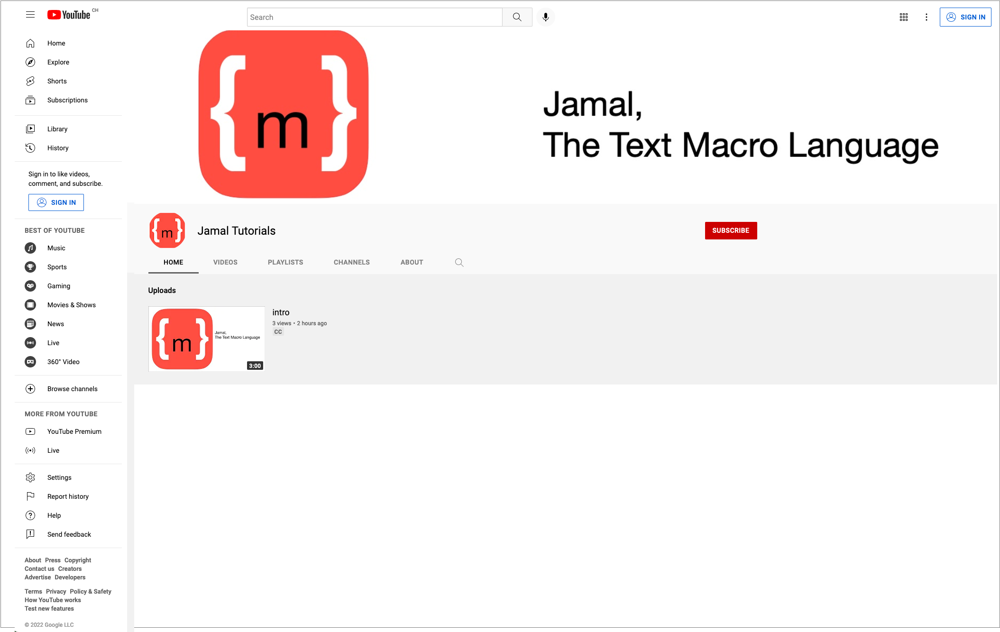

= Planned and Created Video Tutorials

The videos help you jumpstart using Jamal.
They cover introduction and basic features as well as more complex topics.
The videos are published on YouTube:

link:https://www.youtube.com/channel/UCpUOu9zcCUdwAj0H3YzQa3A[YT channel]

== Introductory Videos

=== Intro

link:https://youtu.be/PpSOpRa_738[Watch it on YouTube] (2022-05-18) 

General introduction to Jamal, possibilities, what it is good for, and I also talk about the planned videos.

=== Installing Jamal for IntelliJ and AsciiDoctor

link:https://youtu.be/b6uBseiZlQg[Watch it on YouTube] (2022-05-19) 

How to install the latest release of Jamal to be used with AsciiDoctor IntelliJ plugin.

=== Adding version information to the README file of JUnit Pioneer

link:https://youtu.be/bMCsUYRp-Ts[Watch it on YouTube] (2022-06-06) 

How to install the latest release of Jamal to be used with AsciiDoctor IntelliJ plugin.

=== Jamal Basics

PLANNED 

Basic syntax of Jamal macros in text files.
How do macros start and end in the text and how they are processed.
How to change the macro start and end strings.
What is the difference between a user defined macro and a built/in macro.

=== Jamal Modules

PLANNED 

Go through the different modules that present in the Jamal project and what they contain and how to use them.

=== Jamal Command-Line and jbang

PLANNED 

How to start Jamal using the command line via `jbang` starter.

=== Jamal Maven Plugin

PLANNED 

How to convert your Jamal files in a Maven project configuring the Jamal Maven plugin in your `pom.xml`.

=== Jamal Maven Extension

PLANNED 

How to use Jamal in your POM filer and what you can do in a `pom.jam` and why it is better than Polyglot Maven.

=== Macro Scopes

PLANNED 

How long a macro is accessible in the text.
How to define a macro that has a local scope and what are global macros.
How to start a new scope and how to nest the scopes.
How to export a macro from a scope to the surrounding scope.

=== Debugging Jamal

PLANNED 

How to start Jamal in debug mode and how to start and use the Jamal debugger using your favourite browser.

=== Including Source Snippets

PLANNED 

How to include source code into your documentation.
Formatting source snippets, filtering, numbering, transforming, trimming lines.

=== Keeping Part of the Documentation in the Source

PLANNED 

How to maintain part of the documentation keeping it in the source code.
For example the list of a program options and the one sentence explanation of each option fit well into comments.

=== Numbering chapters, Sections, Subsections, and so on...

PLANNED 

How to use Jamal to number chapters, sections, subsections, notes, pictures or anything.
How to store the numbers and use the reference later.

== Core Built-in Macros

Each video on this chapter is about a core built-in macro.
How to use, what options the macro supports and what is the intended use.

=== Define

PLANNED 

Define and use user defined macros.
This is detailed in other videos as well, but in this video we will look at all the available features.

=== Begin and End macros

PLANNED 

How to start and end a scope using macros and naming the scope.

=== Block

PLANNED 

How to enclose macro definitions into a local scope to eliminate side effects.

=== Comment

PLANNED 

Inserting comments into your macro file.

=== Defer

PLANNED 

How to execute some macro at the end of the processing.

=== Env

PLANNED 

Access environment variables.

=== Escape

PLANNED 

How to escape macro evaluation in case something looks like a macro, but it is not and Jamal must not evaluate it as such.

=== Eval

PLANNED 

How to evaluate some text as macro that would not be evaluated with the usual evaluation order.

=== Export

PLANNED 

How to export user defined macros and whatnot from a scope to one scope above.

=== For

PLANNED 

How to iterate through several values and generate repeated text with parameters.

=== Ident

PLANNED 

How to protect some text from evaluation, and modify the evaluation order of the macros.
This is similar to `escape` but not exactly the same.

=== If

PLANNED 

How to have conditional text.

=== Import and Include

PLANNED 

How to import macro definitions from Jamal Import (`.jim`) files and how to include files.

=== JShell

PLANNED 

How to execute JShell from inside Jamal.

=== Macro

PLANNED 

=== Options

PLANNED 

=== Require

PLANNED 

=== Script

PLANNED 

=== Sep

PLANNED 

=== Try

PLANNED 

=== Undefine

PLANNED 

=== Use

PLANNED 

== Advanced Topics

=== Macro Evaluation Order

PLANNED 

Macros are evaluated from inside out, and sometimes outside in.
How to control macro evaluation order and why it is important.

=== Deferred Macro evaluation

PLANNED 

How can you process the whole input file using a macro after the whole file was already processed.