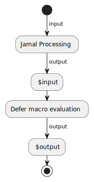

= `defer`

since version `1.10.0`


The macro `defer` stores its input, and evaluates it when the processing of the input file is finished.
It can be used to execute some macros at the end of the execution for the side effects or to modify the final output.

Using this macro is complex.
It is an advanced technique.

At the place of the macro the value of the macro is an empty string.
When the macro finally runs, it may create some output, but it is not used.
Since the execution happens when the processing of the input file is finished, the output cannot be used reasonably.
There is, however, a possibility for the content of the macro to read and optionally modify the final output.

When the input of the macro is executed the global macro `$input` contains the output of the processing.
The naming may be strange at first, naming the  output of the processing "input".
However, every output is the input of the next step in a processing chain.
The content of `$input` is the text the deferred macro can work with, hence it is the input for this step.



If this evaluation defines the global macro `$output` the value of the macro will be used instead of the original output.

The name of the input and output macros can be changed using options.
The options

* `$input` with the aliases `input`, and `inputName` can specify the name of the input macro.

* `$output` with the aliases `output`, and `outputName` can specify the name of the output macro.

As usually the option name can be defined as a macro, like `{@define $input=$INPUT}`, the aliases can only be used as macro options, like

.Jamal source
[source]
----
{@defer [output=OUTPUT] ... }
----

NOTE: You probably want to use the macro `defer` with the `@` character in front of the macro name.
If you use `#`, then the content is evaluated before the macro `defer` is executed.
In this case, the macro sees the evaluated input and will defer the evaluation of the already evaluated text to the end of the execution.

== Examples

In the following, we will give some examples.

=== Simple Example doing null operation

This example is the simplest.
It defers an empty string.


.Jamal source
[source]
----
{@defer}
Original result.
----

When the empty string is evaluated, nothing happens, the original output is retained:

.output
[source]
----
Original result.
----


=== Example, duplicating the output

The second example is a bit more complex:

.Jamal source
[source]
----
{@defer {#define $output={$input}{$input}}}\
Is this duplicated?
----

In the deferred evaluation the macro `$output` is defined, and it will be the same as the `$input` repeated.

.output
[source]
----
Is this duplicated?Is this duplicated?
----


The answer to the question is eventually yes and yes.

=== Example, execution order of deferred actions

The next example demonstrates that

- the name of the input and output macros can be redefined, and
- multiple `defer` macros are executed in the order as they were evaluated in the input during the Jamal processing.

.Jamal source
[source]
----
{#block
{@define $output=OUT}\
{@define $input=IN}\
{@defer
{#define OUT=|{IN}|}\
}\
}\
{@defer {#define $output=*{$input}*}}\
Framed
----

Note that the definition of the macros `$input` and `$output` are local to the `block` and therefore they have no impact on the second `defer`.
Since the `{#define OUT=|{IN}|}` is defined before `pass:[{#define $output=*{$input}*}]` the text `Framed` is enclosed first between `|` characters and only the result is enclosed between `pass:[*]`.

The output is:

.output
[source]
----
*|Framed|*
----


=== Example, using options defining the input and output names

The next example repeats the previous one but uses options instead of macros for the input and output names.
It uses macro options to set the input and output names for the first `defer` macro:

.Jamal source
[source]
----
{@defer [input=IN output=OUT]
{#define OUT=|{IN}|}\
}\
{@defer {#define $output=*{$input}*}}\
Framed
----

In this case there is no need for the `block` macro, since option setting is always local to the macro where it is set.
The result is the same as in the previous case:

.output
[source]
----
*|Framed|*
----


=== Example, not using the input

The next example shows that you do not need to use the input at all to set the output.
The sample simply sets the `$output` to an empty string.
This makes the whole prior processing ignored.

.Jamal source
[source]
----
{@defer
{#define $output=}{@comment just nothing}
}\
Is this ignored?
----

In this case, the output is an empty string

.output
[source]
----

----


=== Example, late macro definition

The following sample shows that the macros used in the text of `defer` have to be defined only during the deferred execution.
In the example the macro `doplikate` is not defined when used in `defer` only at the end of the file.

.Jamal source
[source]
----
{@defer
{#define $output={doplikate/{$input}}}
}\
Annoying?{@define ~ doplikate(a)=a a}\
----

The output is:

.output
[source]
----
Annoying? Annoying?
----


=== Example, mixing with other deferred actions

The following example is a bit more complex.
In this case the code uses the `escape*` macro.
It is an important example of demonstrating the execution order of the deferred actions.

.Jamal source
[source]
----
{@escape*````}\
{@defer
{#define $output={doplikate/{$input}}}{@comment DEBUG}
}\
{@escape* ``{mememe}``}Mememe?{@define ~ doplikate(a)=aa}\
----

In this case, there are two deferred operations.
The first one is the unescaping of the content of the `escape*` macros.
Because the first `escape*` macro is used before the `defer` macro, the `escape*` deferred action is executed first.

There is only one deferred action doing the unescaping, even though there are multiple `escape*` macros.
If you are not familiar what the link:escape[`escape`] macro does, please read the documentation of the macro.

When this unescaping is finished the result of the processing will be `{mememe}Mememe?`.
It contains a string that can be interpreted as a macro.
The macro `doplikate` is defined as a "verbatim" macro.
This is signaled by the `~` character after the `define` keyword.
Verbatim user defined macros are not post evaluated.

When `doplikate` is invoked in the `defer`, then `{mememe}Mememe?` will be converted to `{mememe}Mememe?{mememe}Mememe?`.
This result also will not be evaluated again.

However, when we set the macro `$output` in the line `{#define $output={doplikate/{$input}}}` why `{mememe}Mememe?` is not evaluated.
The reason is that the user defined macro `$input` holding the final result of the Jamal processing is also a verbatim macro.

The output is:

.output
[source]
----
{mememe}Mememe?{mememe}Mememe?
----


Although `$input` is verbatim, `$output` does not need to be.
This macro is used temporarily by the deferred action to change the output of Jamal processing.
After that `$output` gets undefined, hence it does not matter if it is verbatim or not.

=== Example, `$output` is undefined at the start of the deferred action

The following example shows that the value of `$output` is not available as input for `defer`.

The macro `$output` can only be set by `defer`.
It is undefined when the evaluation starts:

.Jamal source
[source]
----
{@defer {#define $output=aaa{?$output}}}\
{#define $output=this will not survive}
This also will be dropped.
----

This example tries to use the value of the macro `$output` in the deferred code.
The deferred code can rely on the macros defined during the Jamal processing.
Note, however, that

* only the top level macros are available

* local macros are out of scope, and

* only those macros, which were defined at the end of the Jamal processing.

The macro `$output`, however, is used in a special way.
Because it serves to pass a modified output from the deferred code, it gets undefined before the deferred code starts.
The result of this evaluation is:

.output
[source]
----
aaa
----


=== Example, `$output` is undefined at the start of __any__ deferred action

The macro `$output` gets undefined before the evaluation of every the deferred code.
If we extend the previous example and define the output in one deferred code and try to use that in the next one, it will still be undefined.

.Jamal source
[source]
----
{@defer {#define $output=this will not survive{?$output}}}\
{@defer {#define $output=aaa{?$output}}}\
{#define $output=this also will not survive}
Annoying?
----

The output is still:

.output
[source]
----
aaa
----


The `$output` set during the evaluation of the first deferred action is not available in the second one.

=== Example, other macros survive

The last example shows that other macros survive and can be used in subsequent deferred actions.
If the macro `doplikate` is defined in a deferred action, then the subsequent deferred actions can use the macro:

.Jamal source
[source]
----
{@defer {#define $output=|{$input}|}}\
{@defer {@define ~ doplikate(a)=a/a}}\
{@defer {#define $output={doplikate {$input}}}}\
wuff
----

In this example, the first deferred action encloses the result between `|` characters.
The second action does not modify the output, but defines the macro `doplikate`.
The third action uses the macro `doplikate` to duplicate the output.

And the output is:

.output
[source]
----
|wuff|/|wuff|
----


