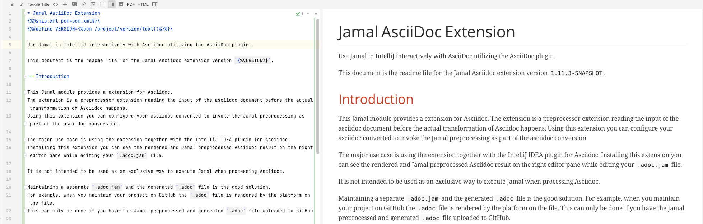
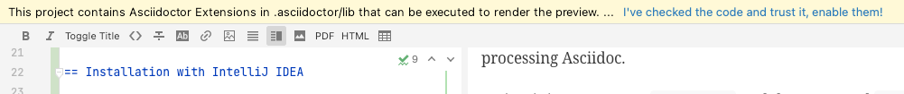
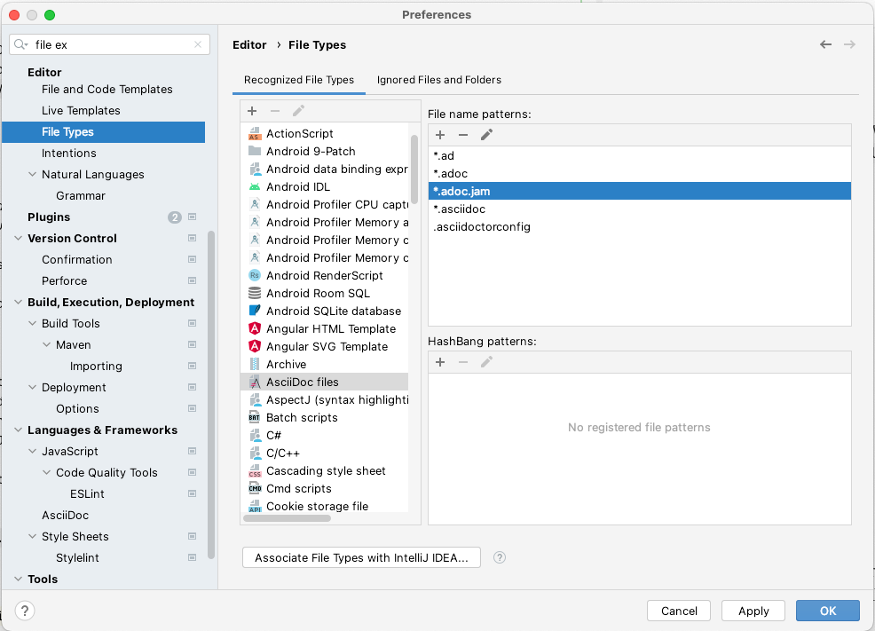
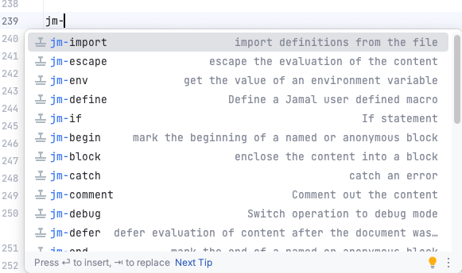
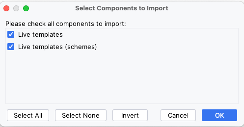

= Jamal AsciiDoc Extension

Use Jamal in IntelliJ or AsciidocFX interactively with AsciiDoc utilizing the AsciiDoc plugin.

This document is the readme file for the Jamal Asciidoc extension version `2.3.1-SNAPSHOT`.

== Introduction

This Jamal module provides an extension for Asciidoctor.
The extension is a preprocessor extension reading the input of the Asciidoc document before the actual transformation of Asciidoc happens.
Using this extension, you can configure your Asciidoc converter to invoke the Jamal preprocessing as part of the Asciidoc conversion.

The primary use case is using the extension with the IntelliJ IDEA plugin for Asciidoc.
Installing this extension, you can see the rendered and Jamal preprocessed Asciidoc result on the right editor pane while editing your `.adoc.jam` file.

It is not intended to be used as an exclusive way to execute Jamal when processing Asciidoc.

Maintaining a separate `.adoc.jam` and the generated `.adoc` file is a good solution.
For example, when you maintain your project on GitHub, the `.adoc` file is rendered by the platform on the file.
You can only do it if you have the Jamal preprocessed and generated `.adoc` file uploaded to GitHub.

== Installation with IntelliJ IDEA

[NOTE]
====
Asciidoc plugin is a plugin into IntelliJ.
The code in this module is not an IntelliJ plugin.
It is an extension to Asciidoctor, which itself is an IntelliJ plugin.
This way, this extension is an extension of a plugin.
You cannot install this extension as a separate plugin to IntelliJ.
It works only with the Asciidoc plugin in IntelliJ.
====

To use the plugin together with the IntelliJ Asciidoc plugin, you need the file `jamal-asciidoc-2.3.0-jamal-asciidoc-distribution.zip`.

You can download this file from the central Maven repository using the URLs:

https://repo.maven.apache.org/maven2/com/javax0/jamal/jamal-asciidoc/2.3.0/jamal-asciidoc-2.3.0-jamal-asciidoc-distribution.zip[``https://repo.maven.apache.org/maven2/com/javax0/jamal/jamal-asciidoc/2.3.0/jamal-asciidoc-2.3.0-jamal-asciidoc-distribution.zip``]

https://repo.maven.apache.org/maven2/com/javax0/jamal/jamal-asciidoc/2.3.0/jamal-asciidoc-2.3.0-jamal-asciidoc-distribution.zip.asc[``https://repo.maven.apache.org/maven2/com/javax0/jamal/jamal-asciidoc/2.3.0/jamal-asciidoc-2.3.0-jamal-asciidoc-distribution.zip.asc``]

https://repo.maven.apache.org/maven2/com/javax0/jamal/jamal-asciidoc/2.3.0/jamal-asciidoc-2.3.0-jamal-asciidoc-distribution.zip.md5[``https://repo.maven.apache.org/maven2/com/javax0/jamal/jamal-asciidoc/2.3.0/jamal-asciidoc-2.3.0-jamal-asciidoc-distribution.zip.md5``]

https://repo.maven.apache.org/maven2/com/javax0/jamal/jamal-asciidoc/2.3.0/jamal-asciidoc-2.3.0-jamal-asciidoc-distribution.zip.sha1[``https://repo.maven.apache.org/maven2/com/javax0/jamal/jamal-asciidoc/2.3.0/jamal-asciidoc-2.3.0-jamal-asciidoc-distribution.zip.sha1``]

The ZIP file contains all the JAR files, the `.asc`, `.md5` and `.sha1` files are standard checksum files to check the integrity of the archive.

Extract the content of this zip file into your projects `.Asciidoctor/lib` folder.

Restart IntelliJ.
As soon as you open a file configured as Asciidoc and has the extension `.jam`, it will ask you:

__This project contains Asciidoctor Extensions in .asciidoctor/lib that can be executed to render the preview. As this Ruby code runs as your local user, don't run this code unchecked.__

then select the first line that says

__I've checked the code and trust it, enable them!__

[NOTE]
====
Do not believe all that the message says.
It is not Ruby code.
This extension is written in Java.
However, using the Jamal Ruby extension, you may execute some Ruby code in your Asciidoc document.
But only if you want.
====

Open the Preferences window of IntelliJ and select `File Types`.
Under the recognized file types, select `AsciiDoc files`.
Under the `File name patterns:` click on the plus sign and add `*.jam`

It will associate the Asciidoctor plugin with the files with the `.jam` extension.
The Jamal extension does not start the processing when you look at files that do not have the `.jam` ending.

Start editing the `.jam` file and look at the right pane at the rendered document.

[NOTE]
====
Before version 1.12.4, associating Asciidoc with the extension `.adoc.jam` was recommended.
Starting with this release, you can use the extension for Jamal files, which are not in asciidoc format.
The extension sees when the processed file does NOT have the `.adoc` file name extension in front of the final `.jam` extension.
In this case, the generated output for the display will get a `[source]\n----\n` prefix and a `----\n` postfix.
It will make the asciidoctor plugin display the content as preformatted source code.

The extension does not add the prefix and postfix to the saved file.
It is added only to the text for the display.
====

== Installation with AsciidocFX

The installation for AsciidocFX needs to copy all the JAR files downloadable from Maven central

https://repo.maven.apache.org/maven2/com/javax0/jamal/jamal-asciidoc/2.3.0/jamal-asciidoc-2.3.0-jamal-asciidoc-distribution.zip[``https://repo.maven.apache.org/maven2/com/javax0/jamal/jamal-asciidoc/2.3.0/jamal-asciidoc-2.3.0-jamal-asciidoc-distribution.zip``]

https://repo.maven.apache.org/maven2/com/javax0/jamal/jamal-asciidoc/2.3.0/jamal-asciidoc-2.3.0-jamal-asciidoc-distribution.zip.asc[``https://repo.maven.apache.org/maven2/com/javax0/jamal/jamal-asciidoc/2.3.0/jamal-asciidoc-2.3.0-jamal-asciidoc-distribution.zip.asc``]

https://repo.maven.apache.org/maven2/com/javax0/jamal/jamal-asciidoc/2.3.0/jamal-asciidoc-2.3.0-jamal-asciidoc-distribution.zip.md5[``https://repo.maven.apache.org/maven2/com/javax0/jamal/jamal-asciidoc/2.3.0/jamal-asciidoc-2.3.0-jamal-asciidoc-distribution.zip.md5``]

https://repo.maven.apache.org/maven2/com/javax0/jamal/jamal-asciidoc/2.3.0/jamal-asciidoc-2.3.0-jamal-asciidoc-distribution.zip.sha1[``https://repo.maven.apache.org/maven2/com/javax0/jamal/jamal-asciidoc/2.3.0/jamal-asciidoc-2.3.0-jamal-asciidoc-distribution.zip.sha1``]

into the `lib` directory of your AsciidocFX installation.
It is 

* `~/Applications/AsciidocFX/lib` on MacOs
* TBD on Linux, and
* TBD on Windows

Note that you need AsciidocFX 1.8.5 or newer.

After copying the files, you will get an error message warning you about duplicate JAR libraries of different versions.
The reason for that is AsciidocFX using older versions in many cases.
The message recommends removing the older versions.
Please, do that.
Currently, there is no automated tool to assist the removal of the older versions.

NOTE: There is no guarantee that this will work.
As for Jamal 2.2.0 and AsciidocFX 1.8.5 the experiments showed no issues running AsccidocFX with Jamal.
Most of the libraries have newer versions, which are minor version updates.
The Yaml handling library, however, is 1.3 for AsciidocFX and 2.0 for Jamal.
The APIs of the two versions are not compatible, and it may cause issues in some cases.

After the files are copied to the `lib` folder you need to restart AsciidocFX and that is it.
AsciidocFX 1.8.5 and later versions recognize `.jam` as an Asciidoc extension and will work properly.
There is no need to copy Jamal into each project directory separately.

== Usage

After the installation, you can open any file that has the extension `.jam` and have a look at the right pane at the rendered document.

The default macro opening and closing strings are .
It is the usual convention when editing Asciidoc files with Jamal preprocessor.
The reason for this is that these documents many times include sample code snippets that frequently may have `{` and `}` in them.
Asciidoc also uses the `{` and `}` to denote attributes.
If you want to use `{` and `}` as macro opening and closing strings, then start your file with the line:

[source]
----
{@comment }\
----

When the first two characters of the document are `{@`, then the macro opening and closing strings will be `{` and `}`.
It is what the core built-in macro `import` also does.
The back-slash following the macro closing string escapes the new line, thus this comment is truly an empty string.

It is a frequent mistake to start the document with some macro other than an empty comment.
Sometimes the macro start changes from `{@` to `{#` to pre-evaluate the macro input.
With that, all of a sudden the macros are not recognized anymore.
It is safer to use the empty comment as a "shebang" line.

=== Asciidoc

When you edit an asciidoc file the extension is `adoc.jam`.
The plugin converts the Jamal macros and passes the pure asciidoc document to the IntelliJ Asciidoctor plugin.
You edit the file and see the result instantly in the other editor pane.

=== Markdown

When you edit a Markdown file, the extension is either `md.jam` or `markdown.jam`.
The plugin first converts the Jamal macros and then converts the markdown to Asciidoc.
The Jamal processed markdown file is saved into the output, but the converted Asciidoc is passed to the IntelliJ Asciidoctor plugin.
That way you edit the markdown and see the result instantly in the other editor pane.

In IntelliJ, there is a plugin to display Markdown files.
In this case, it is not invoked.
The preview of the document may look slightly different from the Markdown preview.
If you are interested how the Markdown plugin renders the same document, you can open any times the saves `.md` file.

=== Xml

The xml conversion happens the same way as any text format.
It is handled separately to add the `xml` formatting after the `source` as `[source,xml]` in the case of `pom.jam` files.

=== Text

The editor will treat a file as plain text when the extension is not recognized by any of the extension converters.
The details about converters you can plug into the process are covered in the next section _"Other formats"_.
In this case, the plugin first converts the Jamal macros and then converts the text to Asciidoc plain text.
That way it adds

  [source,xxx]
  ----

in front of the text and adds

  ----

at the end of the file.
The characters `xxx` in the actual conversion will be the internal extension that stands before the final `.jam` extension.
For example editing `my_gorgeous.xml.jam` will start with `[source,xml]`.
That way you edit the text and see the result instantly in the other editor pane.

NOTE: The conversion also manages when there is a line containing only `----` in the text.

=== Other formats

The conversion of different formats is not hardwired into the preprocessor.
You do not need, but can create Java classes doing conversion from different formats to Asciidoc.
The preprocessor defines the interface `javax0.jamal.asciidoc.Converter` and uses all converters available.
The interface implementations are loaded using the service loader as defined in the Java 9 module systems.

There are two converters supplied inside the JAR file of the preprocessor itself:

* Asciidoc -> Asciidoc converter (`javax0.jamal.asciidoc.AsciiDocConverter`)

* Markdown -> Asciidoc converter (`javax0.jamal.asciidoc.MarkdownConverter`)

The first one is fairly obvious, it just leaves the text as it is after the Jamal processing.
The markdown conversion converts from markdown to asciidoc.

If there are other implementations in some JAR files copied into the  `.asciidoctor/lib` properly exposed to the service loader then they will also be consulted.
The method `canConvert(name)` is consulted for each converter passing the file name.
If any of the converters' method returns `true`, stating that the specific converter can convert the file then the `convert(lines)` will be invoked.
Only one converter is invoked for an input.

If none of the converters can convert the input, then it is converted using the built-in text converter.

=== Live Templates

When you use Jamal in the IntelliJ Asciidoctor plugin, you can separately install IntelliJ live templates.
These templates help you to write macros.
The template names all start with the prefix `jm-`.
If you start typing it, IntelliJ will automatically offer the templates that you can select from:

To install the live templates, download the ZIP file

* `https://raw.githubusercontent.com/verhas/jamal/master/jamal-asciidoc/live-templates.zip[]`

When you have this file downloaded, you have to use the IntelliJ menu:

* `File` -> `Manage IDE Settings  >` -> `Import Settings...`

This menu brings up a file selector.
You have to navigate to the downloaded ZIP file and select it.

On the modal dialog:

ensure that the checkboxes are selected and then press `OK`.
The next dialog will need your confirmation to restart the IDE:

Click`Import and Restart`.

After the IDE restarted you will have your live templates at your disposal.

=== Configuration

You can configure the extension using the Jamal built-in configuration mechanism, which uses

* environment variables,
* system variables, or
* properties files.

The configuration uses the exact mechanism that Jamal uses when searching for configuration options.
The search order and key name translations are described in the documentation of the macro link:../README.adoc#env[`env`].

When looking for a configuration value `X_Y_Z`, then the following search order is used:

* First, the code looks at the Java system properties for `x.y.z`.
* If there is no system property with that name, it looks at the environment variable `X_Y_Z`.
* Finally, it tries to look up the configuration value `x.y.z` from the `~/.jamal/setting.properties` or `~/.jamal/setting.xml` file.

The following configuration values are supported:

* `ASCIIDOC_EXTENSION_OPEN` can define the macro opening string. The default value is .
* `ASCIIDOC_EXTENSION_NOSAVE` can be `true` or `false`, and it defines whether the extension should save the rendered document to the file system.
The default value is `false`, meaning that the rendered document is saved to the file system.

* `ASCIIDOC_EXTENSION_LOG` can be `true` or `false`, defining whether the extension should log the rendering.
The default value is `false`, meaning no logging by default.

* `ASCIIDOC_EXTENSION_EXTERNAL` can instruct the extension to start Jamal as an external process, convert the input to the output and then read the lines of the generated file and return it for the Asciidoc plugin.
The external command to be executed can be configured using the next, `ASCIIDOC_EXTENSION_EXTERNAL_COMMAND` configuration.
Note that starting an external process may need significant resource and may significantly slow down the rendering.

* `ASCIIDOC_EXTENSION_EXTERNAL_COMMAND` can specify the command to execute when the preprocessing is done using an external process.

* `ASCIIDOC_EXTENSION_NO_DEPENDENCIES` can be `true` or `false` defining whether the extension should consider the included files change when caching.
The option is `false` by default, which means that the caching examines all the included, imported and other files that were used during the processing.

* `ASCIIDOC_EXTENSION_FROM_FILE` instructs the Jamal preprocessor to read the content of the saved file instead of the lines provided by the Asciidoctor plugin to preprocess.
It will result in less processing along with the use of the in-memory cache.
The user has to press Control-S (or Command-S on Mac) to refresh the formatted Asciidoc output.
It is also to note that Asciidoctor already processes the lines before invoking the Jamal preprocessor.
If this variable is true, reading from a file will eliminate the effects of these processes.
The output in some special cases may be different.
The default value is `false`, meaning that the content provided by the IntelliJ plugin is used.

* `ASCIIDOC_EXTENSION_KEEP_FRONT_MATTER` instructs Jamal to remove the front-matter, like
+
[source]
----
---
publish_date: 2022-01-13
---
----
+
These lines are usually used by site builder tools, like Jekyll, and they are ignored by Asciidoctor.
Asciidoctor removes these lines before starting Jamal.
Jamal puts these lines back; thus you can have Jamal macros even in the front-end.
You can also have macros in front of the front-matter assumed they do not produce any output.
However, since Asciidoctor has removed these lines, it also expects that they are not present when the lines are processed by Jamal.
The default behaviour is to remove the front-matter after Jamal has finished.
+
NOTE: The front-matter is removed only from the lines, which are passed to the Asciidoctor plugin.
They are never removed from the output saved into the output file.
+
Using this option, you can instruct Jamal to keep the front matter.
+
This option is only consulted when the file is formatted as Asciidoc, having the file extension `.adoc.jam`.
For other files, any font-matter is kept as it is, and becomes part of the preformatted source asciidoc text.
+
[NOTE]
====
The input text provided by as a list of lines does not contain the front matter when Jamal is started.
Jamal fetches the front matter calling
[source,java]
----
final var frontMatter = document.getAttribute("front-matter", null);
----
The result contains the front matter as a string omitting the last new-line character.
Because the last new-line character is missing, Asciidoctor passes an empty string when the front matter is empty, but also when the front matter is an empty line.
This should not cause any problem.
If this is really a problem in your application, you can use the `ASCIIDOC_EXTENSION_FROM_FILE`, `fromFile` option.
====

Note that these names should be translated to a lower case and use `.` as separator instead of `_` when using the `~/.jamal/setting.properties` or `~/.jamal/setting.xml` file. For example, in the `~/.jamal/setting.properties` file you should write

    asciidoc.extension.log=true

instead of `ASCIIDOC_EXTENSION_LOG`.

=== Predefined Macros

The plugin defines the following macro before starting the preprocessing:

* `asciidoctorj:version` is the version of the AsciidoctorJ library used by the IntelliJ plugin.
It is .
If you see no version number, then the Asciidoc file was created by Jamal running in a different installation and not AsciidoctorJ integration.

Consider the possibilities that the macros may not be defined when running the conversion outside of IntelliJ or other AsciidoctorJ integration.
To avoid error use the `{?...}` format when referencing the macro.

=== Special Environment Variables `intellij.asciidoctor.plugin` and `asciidocfx.asciidoctor.plugin`

The system property `intellij.asciidoctor.plugin` and `asciidocfx.asciidoctor.plugin` are defined by the embedding environment.
You can use this via the `env` macro to decide if the Jamal processor is running as an asciidoctor preprocessor.

[source]
----
{#if /{@env intellij.asciidoctor.plugin}/This was compiled in IntelliJ or AsciidocFX/This was compiled outside IntelliJ or AsciidocFX/}
----

will result in

[source]
----
This was compiled outside IntelliJ or AsciidocFX/
----

You should use this macro only for very special purposes.
Using this macro will result different output based on the different Jamal processor environment.
Currently, there is no support to distinguish between IntelliJ and AsciidocFX environment.

The use case for the environment variable is executing external processors or retrieving expensive resources.
Examples:

* A macro executing Mermaid or some other processing as an external tool may execute the external tool in an asynchronous way when running inside an editor.
The external processing may finish later than Jamal finishes.
In this case, the preview of the document will show a broken image until the processing is finished.
The next time the preview is refreshed, the image will be shown.
+
When the same code runs out of the editor, the external processing will be executed synchronously.
The execution time of Jamal may be longer, but it does not affect an interactive user.
On the other hand, it is guaranteed that the generated picture is there.

* Another example is retrieving a response from ChatGPT.
Getting the response may take a few seconds or even minutes.
When running inside an editor, the response will be retrieved asynchronously, and the preview will be available.
This preview will show a message about the ongoing processing.
This is better than freezing the rendering for long seconds.
+
When running outside of the editor, the response will be retrieved synchronously, same as in the previous example.

NOTE: When the environment variable was introduced, I had no idea any use of it.

=== Options

You can alter the auxiliary functions of the extension using options.
You can place these options into the document's first line into a comment.
If an option is defined for something controllable by configuration, then the option will take precedence.

[source]
----
{@comment off noSave log external fromFile noDependencies keepFrontMatter dual}
----

or

[source]
----

----

You can place any of the options listed in the above example separated by spaces in any order.

==== off

Sometimes you may want to switch off the Jamal preprocessor for a specific document.
The output of the preprocessing will be the same as the input.
This way, the Asciidoc rendering will not be affected by the preprocessing.

==== noSave

The extension saves the preprocessed document in the `.adoc` file by default.
It is assumed that if you have a file named `xxxx.adoc.jam`, then your `xxxx.adoc` file is generated.

Use this option to switch off this file writing.
You may need it on some older machines or in the case of extensive documents to improve performance.

For backward compatibility reason you can also use the option lower case: `nosave`.

==== prefixLog
Using this option, the plugin will insert the log messages into the output file at the start.
Log messages are generated by different macros for debugging purposes and also using the `{@log ...}` macro.

Note that these log messages will only get into the displayed version and not into the saved file version.

==== log

You may be interested in how many times and when the extension regenerated the output file.
To get that information, you can use the option `log` as

[soure]
----
{@comment log}
----

in the first line of the document.
It will instruct the extension to append a line like

----
[INFO] 2022-03-26T12:14:49.303437 saved
----

to the log file.
The log file's name is the same as the output file with the extension `.log` appended.
For example, if you edit the file `README.adoc.jam`, the output file will be `README.adoc`, and the log file will be `README.adoc.log`.

This log file can overgrow and become fat.
Feel free to delete the log file.

==== external

In some cases, you may need to execute the rendering using an external process.
This option instructs the extension to start Jamal as an external process, convert the input to the output and then read the lines of the generated file and return it for the Asciidoc plugin.

==== fromFile

Will instruct Jamal to ignore the lines that the Asciidoctor plugin is providing and read the lines directly from the file.
There are two effects.

. Instructing Jamal to read from the file will save processing, because the file does not change so frequently.
It also means that the user has to press the control-S or command-s button or use the menu to save the file to see any change in the rendered Asciidoc window.

. The other effect is that any other preprocessor result running before Jamal is dropped.
The Asciidoctor plugin may call other preprocessors before Jamal.
When the IntelliJ plugin passes the lines are passed to Jamal, some of these preprocessors may have already modified the lines.
These modifications get lost.

[NOTE]
====
We have experienced using Jekyll that the Asciidoc files containing

[source]
----
---
key: value
---
----

front matters are not fully passed to the Jamal preprocessor.
The front matter lines between the `---` lines are not present in the lines provided by Asciidoctor.
This behavior was incorporated in Jamal version 1.12.4 and Jamal works as expected.
In prior versions, you can use a workaround as described below.
To overcome these, it is recommended to start these files with a Jamal comment, like:

[source]
----
{@comment just make some comment}\
---
key: value
---
----
Note the `\` after the comment line.
It is important, or else the starting `---` will be on the second line following an empty line.
Jekyll does not like the first empty line.
====

See also the `keepFrontMatter` option.

==== noDependencies

It defines that the preprocessor should not consider the included, imported or any other way used files when deciding about the cached result of the rendering.

The IntelliJ Asciidoctor plugin invokes the rendering and the preprocessor in it many times, even when the documentum has not changed.
To ease the burden on the processor the Jamal preprocessor keeps the last execution's result in memory.
When there was no change in any of the files that the processing used then the canned result is returned.
When this option is used then only the edited file is consulted and the other files included, imported or any other way used are not considered.
It means that the file on the screen may not update when one of the included files change.
In that case you have to change the edited file, for example inserting and deleting a space.

This option may be needed when the rendered file reads a lot of other files, using snippets, includes and imports.
This option saves some CPU time when these files do not change.

==== keepFrontMatter

This option will instruct Jamal to keep the front matter in the output to display.
The front-matter is always kept in the file where Jamal saves the output.
On the other hand, Jamal removes the font-matter, so it does not clutter the Asciidoc rendering in the plugin, unless this option is used.
The front matter is always kept when the file is _not_ `adoc.jam`.

==== dual

This option will instruct Jamal to convert the input reading from the file into an asynchronous thread.
The plugin will still convert the input provided by Asciidoctor.
The formatted output displayed will be created from this input.
The output file, however, will be converted separately.

You may want to use this option when you have Asciidoc conditionals in the source.
In this case, the blocks are already filtered when Jamal is started.
Using the option `fromFile` would mess up the display with all these blocks.
AsciiDoc rendering, at that point, already expects them to be filtered out.

The workaround is to use the `dual` option.
It will convert the input as default, provided by the Asciidoctor plugin.
It will also kick in the `noSave` options, so the version without the conditional blocks will not be saved.
At the same time, it will schedule an asynchronous thread to convert the file separately.

Note that there is a difference between the two processing.
Because AsciidoctorJ processes the conditional blocks BEFORE Jamal, you cannot use Jamal macros in these.
During the asynchronous processing, however, Jamal will process the conditional blocks.

As a general advice: do not use Jamal macros in the AsciiDoc conditionals.
If you need to use such functionality, you can implement that using Jamal `if` macros.

When the asynchronous processing runs the special environment variables `intellij.asciidoctor.plugin` and `asciidocfx.asciidoctor.plugin` are NOT set.

The conversions run in a single parallel thread.
If the processing sees at the start that there is already a newer version scheduled to run, then it skips the processing.
The processing should not show any performance degradation on a modern multicore CPU.

The option `dual` has no effect if the option `fromFile` is used.
In this case, the processing already reads the content from the file; starting an asynchronous processing thread is unnecessary.

== Modifying the Output Location

The preprocessor does not only give the output to the Asciidoctor IntelliJ plugin, but also saves it to a file.
The file name is the same as the processed file except the `.jam` extension is chopped off.
The file is saved into the same directory where the Jamal file is.

This default behaviour can be altered defining the user defined macro `asciidoc:output` macro in the Jamal source.
If this macro is defined as an argument less macro, the value will be used to modify the output.
The value of the macro can be a directory or a file.

[source]
----
{@define asciidoc:output=..} will store the output in the parent directory
{@define asciidoc:output=target} will store the output in the target directory
{@define asciidoc:output=myfile.adoc} will store the output into the file myfile.adoc
----

The file name can be absolute, or relative to the Jamal input text.

* If the name points to an existing directory, then the output will be saved there.
The name of the file will be the same as input, minus the `.jam` extension.

* If the file does not exist, or it is not a directory, then the output will be saved into the named file.

Processing the Jamal file outside the IntelliJ Asciidoctor plugin extension will ignore this user defined macro.

== Modules

When using Jamal, you probably want to use extra built-in macros in addition to the core modules.
The ZIP file you extracted to the `.Asciidoctor/lib` folder contains the following modules:

* `jamal-engine`

* `jamal-api`

* `jamal-tools`

* `jamal-core`

* `jamal-assertions`

* `jamal-jamal`

* `jamal-markdown`

* `jamal-mock`

* `jamal-plantuml`

* `jamal-snippet`

* `jamal-yaml`

* `jamal-json`

* `jamal-prog`

* `jamal-maven-load`

* `jamal-test`

* `jamal-debug`

* `jamal-maven-input`

* `jamal-jar-input`

It is essentially all the macro modules that come with Jamal by default.
If you want to use additional modules, all you have to do is copy the `.jar` files to the `.Asciidoctor/lib` folder.
The IntelliJ Asciidoc plugin will automatically load the modules.

You can also load macro JARs dynamically using the `maven:load` macro.
For detailed instruction how to use the macro, see the module's link:../jamal-maven-load/README.adoc[README].

== Error Handling

When the Asciidoc conversion finds an error in the document, it still renders the document and creates a preview.
You can do it because Asciidoc is a format where the cohesion between the different parts is not too strong.
If there is an error in the code, the rest of the document may still be rendered and look the same.

Jamal, on the other hand, is a complex macro language.
Likely, it is not possible to reasonably process the input after some error.
If there is an error in the input, the Jamal processor will not produce an output.
As a most functional approach, the extension will result in the input without preprocessing but enriched with error messages.

The extension will insert the error message given by the Jamal processor to the document's start as a WARNING admonition.
It will also insert the same admonition at the line where the error is and at the end of the document.
The error message at the end of the document is followed by a source block, including the full stack trace.

This way, it may be easier to find the error in the document and still see some preview while the input is erroneous.

NOTE: There is an Easter egg in the last line of the error message.
It may be useful when you use `snip:check`.

== Executing External Jamal

It is possible to run Jamal as an external process and get the output of the preprocessing.
To do that, you should configure the external command to execute.
The configuration key is `ASCIIDOC_EXTENSION_EXTERNAL_COMMAND`.
When it is configured in a properties file you should use `asciidoc.extension.external.command`.

For example, the configuration file `~/.jamal/settings.properties` contains the following line on the development machine:

[source]
----
asciidoc.extension.external.command=/Users/verhasp/.jbang/bin/jbang jamal@verhas -open=\{% -close=%\} $1 $2
----

As you can see, I use `jbang` to execute Jamal as an external command.
It is also to note that the `PATH` environment variable may not be available and for this reason the full path is specified.

When executing the external command the placeholder `$1` will be replaced by the input file name and `$2` by the output file name.
The output file name is the same as the input file name without the `.jam` extension.
The extension checks the options in the first line of the document, but in case the execution is done externally the options are ignored, except the `external` option.

[NOTE]
====
This option was developed as a last resort.
For example, the Java JDK used by IntelliJ during the development and hence used to execute Jamal could not find the JShell engine.
The main README uses the JShell engine when it discusses the feature.
With this option, the main README can also be edited WYSIWYG style.
(It is not needed anymore, the top README was modified.)
====

[WARNING]
====
You may recognize that using this option, you can execute any external command.
Keep your `~/.jamal/settings.properties` file secure.
Configure the external command to execute only if you have no other way to use the extension.
====

== Cache

The IntelliJ plugin AsciiDoctor renderer seems to run multiple times even when the file does not change.
Asciidoc rendering may not be cheap, but Jamal processing and the rendering can be really expensive.
Please note that Jamal is almost a full programming language, and you can create fairly complex structures.
However, Jamal processing is supposed to be link:https://www.google.com/search?q=define+idempotent[idempotent].
If you have the same source, you are supposed to get the same output.

[NOTE]
====
If you want to see how many times and when the preprocessor was executed, switch on the logging.
You will see in the log file something like the following:

[source,text]
----
2022-05-13T16:21:21.993262 [993:3989:5E7D6DDB]ApplicationImpl pooled thread 364 started
2022-05-13T16:21:21.997498 [993:3989:5E7D6DDB]ApplicationImpl pooled thread 364 md5 Ei3ZRs4l2zH8J19bzE1KWQ==
2022-05-13T16:21:22.009581 [993:3989:5E7D6DDB]ApplicationImpl pooled thread 364 saved
2022-05-13T16:21:22.255684 [994:3990:75BA8F1E]Alarm Pool started
2022-05-13T16:21:22.258885 [994:3990:75BA8F1E]Alarm Pool md5 Ei3ZRs4l2zH8J19bzE1KWQ==
2022-05-13T16:21:22.259281 [994:3990:75BA8F1E]Alarm Pool restored
2022-05-13T16:21:22.268355 [994:3990:75BA8F1E]Alarm Pool saved
----

The log shows you

* the time when the preprocessor was started
* a counter (993 and 994 in this example), which starts from zero when you start IntelliJ and increments for every preprocessor invocation
* the thread identifier executing the preprocessor
* the hash code of the preprocessor object (you can see that the plugin creates a new preprocessor object for every execution, it is okay)
* `started` the preprocessor _start_
* `saved` the preprocessor _end_, when it saves the result back into the Asciidoctor source
* the md5 fingerprint of the input
* `restored` when the fingerprint shows that the input did not change since the last run

The logging is a troubleshooting feature, and there is no guarantee that this document follows the changes of the logging format.
====

The Jamal Asciidoctor preprocessor stores the result of the last processing (in-memory), and if it sees the same input, it just returns the already calculated output.
The last result is really the last result, even when you keep multiple `.adoc.jam` files in your IntelliJ open.
Editing one of the files will overwrite in the memory the last result form the other file.
This, however, affects only the speed.
The resulting output files, which the preprocessor saves by default, or the rendering results are never affected by this caching.