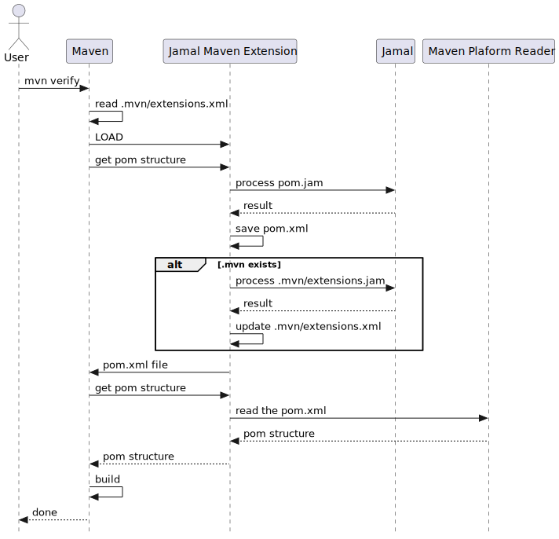

= Jamal Maven Extension

This module lets you maintain your `pom.xml` files using Jamal macros.

[WARNING]
====
This project is a Maven extension.
Maven extensions run before Maven, and they are different from Maven plugins.
The Jamal project supports Maven providing a plugin as well as an extension.
In this documentation, we talk about the use of the extension.
You can use the plugin to aid the use of the extension.
The way to support the use of the extension is also documented here.
The documentation clearly distinguishes the extension from the plugin.
====

Create a `.mvn` in your project root to use this module.
This directory will contain the file `extensions.xml` with the content:

[source,xml]
----
<?xml version="1.0" encoding="UTF-8"?>
<extensions>
    <extension>
        <groupId>com.javax0.jamal</groupId>
        <artifactId>jamal-maven-extension</artifactId>
        <version>2.8.3-SNAPSHOT</version>
    </extension>
</extensions>
----

When you start Maven, it will read the `pom.xml.jam` or `pom.jam` file, convert it using Jamal and create the `pom.xml` file.

[NOTE]
====
The actual process is the following.
When a user invokes Maven, it looks at the `.mvn/extensions.xml` file and it sees that the Jamal Maven Extension is configured there.
It loads the Jamal Maven Extension and invokes it to locate the POM file.
This call assumes that the POM file is already there, and at this point, the extension is supposed to find it.
The Jamal Maven Extension cheats a bit.
First it reads the Jamal source files, and it creates the `pom.xml` file.
The processing includes the resolution of all the macros and the formatting of the final XML result.
When the extension is done with this step, it writes the `pom.xml` file and returns the file reference as a Java `File` object.

Maven later asks for the extension to load the project object model from this file.
The extension knows at this point that the generated `pom.xml` file is a standard XML formatted pom, and it simply asks the standard Maven Platform Reader to read it.
When the Maven Platform Reader returns with the object model, the extension passes it back to Maven, and the rest is standard Maven business as usual.

NOTE: This way you can have the `pom.xml` file and the implementation of the extension was simpler.

====

== Using the Generated `pom.xml`

The created `pom.xml` is saved to the directory and not removed after it was processed.
It is also available for the IDE, which may not read the macro enhanced POM file.
You can add it to your source control if you wish.

== Converting Your Project to Use `pom.jam`

When you want to convert a project to use the Jamal maven extension you only have to

1. create the `.mvn` directory

2. create the `extensions.xml` file

3. rename the existing `pom.xml` files to `pom.jam`.

When you have a multimodule project this can be cumbersome and error-prone.
To automate this, the Jamal Maven plugin can be started with the command line

[source]
----
mvn -Djamalize=true com.javax0.jamal:jamal-maven-plugin:2.8.3-SNAPSHOT:jamal
----

from the top level project directory.

The plugin will scan all the directories from the current and below and if there is only a `pom.xml` in the project directory, but no `pom.jam` nor `pom.xml.jam` then the plugin will copy the `pom.xml` to `pom.jam`.

It is enough to have a single `.mvn` directory at the top level in the project.

== Updating Your Project

When you want to use a new version of the Jamal Maven Extension simply edit the `.mvn/extensions.xml` file and replace the version number.

== Using Jamal to maintain `extensions.xml`

You can use the extension itself to maintain the `extensions.xml` file.
The extension looks into the `.mvn` directory of the project.
If there is an `extensions.jam` or `extensions.xml.jam` file in there, it will be used to generate and overwrite the `extensions.xml` file.
Since the `extensions.xml` is small it may be pointless to maintain it that way, but the possibility exists.

The Jamal project itself could have the following `extensions.jam` file in the project's root directory:

[source]
----
{@import [noCache] https://raw.githubusercontent.com/verhas/jamal/master/version.jim}
{#thinXml
extensions>
  extension>
    groupId>com.javax0.jamal
    artifactId>jamal-maven-extension
    version>{LAST_RELEASE}
}
----

This will always use the latest release version of the extension and keeps the `extensions.xml` file up to date.
If you use `{VERSION}` instead of `{LAST_RELEASE}` in the `extensions.jam` file, the extension will use the actual, possibly development SNAPSHOT version of the project.
When a new release is available it will update the version in the `extensions.xml` and be used during the next build.
The actually running build does not restart with the newer version.

This feature does not work if the version configured in the `extensions.xml` file is older than 1.10.0.
The feature was introduced in 1.10.0.

[NOTE]
====
Jamal's actual `extensions.jam` does not use the option `noCache`.
Using the option would download the latest version of the extension from the internet every time the build starts.
This may impose significant impact on the build time.
A better solution is to use cache eviction introduced in Jamal version 1.11.0.

The file

    ~/.jamal/cache/properties/com/githubusercontent/raw/verhas/jamal/master/version.jim

is a properties file.
Adding `ttl=1d` (time to live = one day) as a new property will check for a new `version.jim` once a day.
In other occasions it will just use the cached file.
====

== Getting Rid of the Extension

NOTE: Remove the `.mv` directory and the Jamal source files, while keeping the generated `pom.xml` files.

It may happen that, for some reason, you want to get rid of the extension.
The reasons can be various.
The maintenance of the project is passed on to a team that is not knowledgeable about Jamal.
A new corporate policy may exclude external tools or restrict the extensions and plugins you can use with Maven.
You may run into some unforeseen complexity problem using Jamal, and you may not have time to debug your macros.
It is straightforward to revert the operation to standard Maven compilation temporarily or final in any of those cases.

This extension retains the XML format as opposed to Polyglot Maven, where you use a Java, Kotlin, Yaml, etc., based DSL instead of XML.
You do not need any conversion step from DSL to XML; the `pom.xml` is always there.
What you have to do to revert the operation to standard Maven and `pom.xml` based compilation is to remove the `.mvn` directory.

If the reverting to standard `pom.xml` based compilation is final, then do not forget to remove the `.mvn` directory from the source control.

== Error Handling and Debugging

If there is an error processing the Jamal file or XML formatting, the extension will give a very detailed stack trace.
Jamal can also be debugged as described in the link:../jamal-debug/README.adoc[debugger documentation].
You have to set an environment variable `JAMAL_DEBUG` to be `http:8080`, start Maven, and when the debugger pauses, open `http://localhost:8080`.
(You can use any other port.)

The commands you will apply are:

[source,bash]
----
export JAMAL_DEBUG=http:8080
mvn verify
unset JAMAL_DEBUG
----

The extension is compatible with the Jamal Maven plugin so that you can generate the `pom.xml` file with command `mvn -f genpom.xml`.

== Available Macros

When Maven loads the Jamal Maven Extension, it recursively loads the dependencies of the artifact.
The dependencies configured are the followings:

===  `api`
This module contains the interfaces that are used all over in Jamal.

===  `tools`
This module contains the tools that are used in Jamal.

===  `core`
This module contains the core built-in macros.

===  `engine`
This module is the Jamal execution engine.
It is needed to execute Jamal.
The module does not provide macros.

===  `snippet`
This module provides snippet macros.

For further information read the link:../jamal-snippet/README.adoc[documentation] of the module.

===  `jamal`

This module lets you call Jamal processing some part of the code in a separate processor.

For further information read the link:../jamal-jamal/README.adoc[documentation] of the module.

For further information read the link:../jamal-java/README.adoc[documentation] of the module.

===  `markdown`
This module lets you convert Markdown to HTML.
This module is mainly practical when you embed Jamal macros in a JavaDoc and use the Jamal doclet extension.
I do not see much use here.

For further information read the link:../jamal-markdown/README.adoc[documentation] of the module.

For further information read the link:../jamal-java/README.adoc[documentation] of the module.

===  `yaml`
This module provides macros that can read, write and manipulate YAML data.
This macro package may be handy if you use macros that build up the POM structure in memory as a YAML structure.
There is a macro that can convert the built-up YAML structure as XML.
Although the conversion from Yaml to XML is limited, it may be very well suited to build up POM structures.
The current macros used in the Jamal projects and some other projects handle the POM structure as XML text and not as structure.
Managing and building up a structure would be much more powerful.
If you want to do anything like that, the in-memory Yaml structures these macros can manage are excellent for the purpose.

For further information read the link:../jamal-yaml/README.adoc[documentation] of the module.

===  `json`
This module provides macros that can read, write and manipulate JSON data.

For further information read the link:../jamal-json/README.adoc[documentation] of the module.

===  `assertions`
This module gives you assertion macros that can fail if certain conditions are not met.

For further information read the link:../jamal-assertions/README.adoc[documentation] of the module.

===  `debug`
This module does not provide any macro, but it has to be on the classpath to start the debugger.
A brief introduction is described above on how to start the Jamal processing when compiling a `pom.xml.jam.

For further information read the link:../jamal-debug/README.adoc[documentation] of the module.

===  `mock`
This module provides a macro to mock the behavior of built-in macros.
This is mainly when debugging or testing the functionality of some macro packages.

For further information read the link:../jamal-mock/README.adoc[documentation] of the module.

===  `prog`
This module extends Jamal with a very simple "BASIC" like programming language.

For further information read the link:../jamal-prog/README.adoc[documentation] of the module.

===  `maven-input`
This library provides Java services that the Jamal file handling uses, so that you can use reference resources from inside maven artifacts over the network.

For further information read the link:../jamal-maven-input/README.adoc[documentation] of the module.

===  `jar-input`
This library provides Java services that the Jamal file handling uses, so that you can use resources from inside JAR files.

For further information read the link:../jamal-jar-input/README.adoc[documentation] of the module.

===  `maven-load`
The library provides macros that can load Java Built-in Macros from Maven artifacts.

For further information read the link:../jamal-maven-load/README.adoc[documentation] of the module.

===  `sql`
The library provides macros that can load Java Built-in Macros from Maven artifacts.

For further information read the link:../jamal-sql/README.adoc[documentation] of the module.

===  `xls`

For further information read the link:../jamal-xls/README.adoc[documentation] of the module.

===  `rest`

For further information read the link:../jamal-rest/README.adoc[documentation] of the module.

===  `git`

For further information read the link:../jamal-git/README.adoc[documentation] of the module.

===  `python`

For further information read the link:../jamal-py/README.adoc[documentation] of the module.