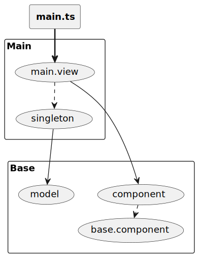

= Using Kroki service

This is a simple demonstration of how you can include pictures using the Kroki service into an Asciidoc file.

You have to import the resource `kroki.jim` into your Asciidoc file.

The `kroki.jim` file contains macros that can be used to include pictures in an Asciidoc file.

After that you can use the `kroki` macro to include pictures.

Using Jamal, you can even use macros inside the picture descriptions.
They will be processed before the picture is rendered.