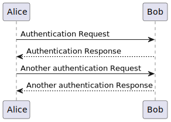
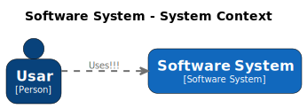

# Using Kroki service

This is a simple demonstration of how you can include pictures using the Kroki service into a Markdown file.

You can import the resource `kroki.jim` into your Markdown file.

The `kroki.jim` file contains macros that to include pictures in a Markdown file.

After that, you can use the `kroki` macro to include pictures.

Using Jamal, you can even use macros inside the picture descriptions.
They will be processed before the picture is rendered.