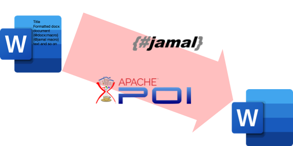

= Jamal Microsoft Word integration module

This module supports the use of Jamal macros in Microsoft Word documents (docx format files).
The macros can be embedded into the text of the Word document and the output will be another word document with the macros processed.
During the processing the text formatting will be preserved and the macros will be evaluated.

That way you can use the macros that you would use to create a maintainable documentation in a Word document.
You are not limited to a textual format like Markdown or Asciidoc.
You can mix the best of the two words (put intended).
Your documentation can be maintained ina WYSIWYG editor, Microsoft Word and the same time you can keep the documentation semantic.

Using macros you can eliminate

* copying and pasting sample code from the documented system,
* manually maintaining configuration parameters,
* manual checking of the document up-to-date status,
* cross-referencing the different documentation parts.

All these tasks can be automated exactly the same way as the format was asciidoc, markdown or any other textual format.
There is no limitation in the DOCX module for the usable macros.
You can use any, the same way as you would use them for a textual document.
In addition to the general macros, which are documented in their library README documentation, there are DOCX format specific macros.
Using these you can programmatically change some properties of the document, like

* switch on track changes in the output document,
* restrict editing,
* password protect the output document,
* include other docx file keeping all the formatting,
* insert a picture using macros programmatically.

The set of the available macros is constantly increasing and follows the demand.
If you have any idea, or need, create a github ticket, requesting the feature.

The DOCX specific macros are documented in this document below.

In the following chapters we discuss how the Jamal processor is used to process word documents.

The section _Using the Module_ describes how you can start Jamal to process Word documents.

The section _Dependency_ is a reference to the Maven coordinates you may need in case you want to use the module embedded into your application.

The section _Macros..._ documents all the `docx:...` macros available in the module.

The last section discusses some Jamal Word specialities.
Jamal is essentially a text processor and special techniques are applied to process formatted text.
In 99% of the cases you do not need to care about the details of the processing.
In the remaining 1%, however, you may see some unexpected behavior, which can be explained understanding htese special techniques. These are detailed in _Jamal MS Word Specialities_.

== Using the Module

The module can be used in two ways.

* Use the command line version of the Jamal using the `--docx` option.
* Call the exported XWPFProcessor API.

For more information how to use the command line version refer to the <<../jamal-cmd/README.adoc#,Jamal Command Line>> document.

To invoke the exported API you have to have the module on the classpath.
The Maven dependency is defined in the next section.

The API call is very simple.
It is the following:

   new XWPFProcessor().process("input.docx", "output.docx");

The program will read the file `input.docx` and write the result to `output.docx`.

== Dependency

To use the module, you have to have the code on the classpath.
This can be done adding

[source,xml]
----
    <groupId>com.javax0.jamal</groupId>
    <artifactId>jamal-word</artifactId>
    <version>2.7.0</version>
----

to your Maven `pom.xml`.

== Macros Implemented in the Module

The module implements the following macros:

=== `docx::protect`

Using this macro you can set the protection of a document.
The syntax of the macro is

[source]
----
  {@docx:protect [password=XXX algorithm=YYY] (trackChanges|readOnly|forms|comments) }
----

You can set a password and an encoding algorithm using the options `password` and `algorithm`.
If these options are not present, then the user can switch the protection off.
When you specify the password and the algorithm then the user can switch off the protection only if they know the password.

The options `trackChanges`, `readOnly`, `forms`, and `comments` are mutually exclusive.
Exactly one of them has to be specified.

final var password = scanner.str(null, "pass`, `password");
This option specifies the password needed to switch off the protection.
If the option is not specified, then the user can switch off the protection with just a few mouse clicks.
        final var algo = scanner.str(null, "alg`, `algo`, `algorithm");
This option specifies the algorithm used to encode the password.
The name of the algorithm is the official ECMA name of the algorithm.
Any of the algorithms can be used implemented by the DOCX format and supported by the underlying Apache POI library.
The algorithm names are:

* `SHA1`
* `SHA256`
* `SHA384`
* `SHA512`
* `MD5`
* `MD2`
* `MD4`
* `RIPEMD-128`
* `RIPEMD-160`
* `WHIRLPOOL`
* `SHA224`
* `RIPEMD-256`

The list of algorithms may change in the future.
To see the actual list of algorithms, specify an invalid algorithm.
The error will list all the currently available algorithms.
        final var track = scanner.bool(null, "track`, `trackChanges");
Specify the protection level so that the document can be changed without changing the state of change tracking.
Reasonably, you want to have the tracking switched on.
To do that you can switch it on in the source document or use the `docx:trackChanges` macro without the `off` option.
        final var readOnly = scanner.bool(null, "read`, `readOnly`, `readonly");
Specify the protection level so that the document is read only.
        final var comments = scanner.bool(null, "comments");
Specify the protection level so that the user can edit only the comments.
        final var forms = scanner.bool(null, "forms");
Specify the protection level so that the user can edit only the forms of the document.

=== `docx::trackChanges`

This macro can switch on or off the track changes in the output document.
The syntax of the macro is

[source]
----
  {@docx::trackChanges}
----

or

[source]
----
  {@docx::trackChanges off}
----

Note that you can also set the protection of the output document so that the change tracking cannot be switched off.

=== `docx::include`

Using this macro you can include the formatted content of another docx file into the currently processed one.
The syntax of the macro is

[source]
----
  {@docx:include file_name}
----
The file name can be absolute or relative to the processed file.
The macro will copy the content of the included file into the current file.
After that the copied parts will be processed by Jamal the same way as they had been in the document before.
This means that including a file from an already included file should use a file name relative to the top level document and not the included one.

=== `docx::picture`

Using this macro you can include a picture into a document.
The syntax of the macro is

[source]
----
  {@docx:picture [options] file_name}
----
The file name can be absolute or relative to the processed file.
The macro will copy the content of the picture file and insert the picture into the document at the place where the macro is in the source document.

Inserting a picture into a document using a macro may seem to be counterintuitive.
This is a functionality supported by the WYSIWYG functionality of Word.
There are two reasons why you may decide to use the macro instead.

. When the external picture is defined by the macro it is read and inserted into the target document by the time the macro processing is executed.
If the picture is not final, and may change during the lifecycle of the documentation the macro will always include the latest version.

. The processing may have different options for the picture and the actual picture may be selected from a set during the macro execution.
In this case it makes perfect sense to use the macro.

If not for these cases then just insert the picture into the document using the Word built-in functionality.
The options that can modify the behavior of the picture handling are:

final var width = scanner.number(null, "width");
can define the width of the picture.
The default value is the actual width of the picture, or a scaled width in case the height is defined and the picture is not distorted.
        final var height = scanner.number(null, "height");
can define the height of the picture.
The default value is the actual height of the picture, or a scaled height in case the width is defined and the picture is not distorted.
        final var distorted = scanner.bool(null, "distort`, `distorted");
can define if the picture is distorted or not.
If a picture is not distorted and only one of the `width` and `height` is defined, the non-defined parameter will be calculated.
In this case, the picture aspect ratio is preserved.
When this option is used and either `width` or `height` is defined, the other parameter will keep the value given by the picture itself.ß

== Jamal MS Word Specialities

The module uses special techniques to invoke the Jamal processor.
Jamal is a text processor.
A Word document, on the other hand mixes textual and formatting information.

Before discussing the details of the technique, let's look at the structure of a Word document.

* A Word document is a collection of paragraphs and tables intermixed.
* A paragraph is a collection of "runs".
A paragraph contains formatting information, which describes the paragraph's appearance.
This is like indenting, centering, etc.
* A run contains text segments and formatting information.
The formatting does not change inside a run, and usually there is only one text segment in a run.
The formatting information of the run describes the appearance of the text.
* Tables intermix with paragraphs.
Tables contain cells and the cells contain paragraphs.
Paragraphs in table cells may intermix with tables any level deep.

The module uses the following techniques to process the macros:

. It reads the document using Apache POI into the memory and then starts to process the paragraphs and the tables.

. The module implements the `Input` api interface in a very special way.
This implementation stored the characters of a single run in a buffer and if the processing needs more characters it dynamically fetches them from the subsequent runs.

. When the processing does not need more characters the Jamal processor does not ask for more characters, and it stops.
At this stage the module restarts the processor in case there is more text to process.
This way the processing of the document is done in chunks.
When a chunk is processed the result of the processing replaces the paragraphs and the runs used up as input.
The formatting of the very first run of the chunk is preserved and used for the whole text of the formatting.

Because the way the processing is done there are a few special rules that macros should follow in a Word document.

* A chunk cannot extend from a top level paragraph into a table and cannot extend out of a table cell.
A macro starting in a top level (not in table) paragraph should be closed before the next table if any.

* A macro starting in a paragraph inside a table cell should be closed inside the cell.

* If there is any table nested in a table cell then a macro starting in a cell paragraph should be closed before the nested table.

* Any formatting inside the definition of a user defined macro will be lost and not copied to the output at the place where the macro is used.
The output of the `define` macro is an empty string.
A user defined macro in Jamal is a processable text including replacements for the actual values of the parameters.
It does not contain any formatting.

* Any formatting in the actual value of the parameters of a macro will be lost and not copied to the output.
The reason is the same as for the user defined macro body.
The parameter of a user defined macro or the input of a built-in macro is text without formatting.

The macro `defer` will work very different in the case of a docx file.
This schedules the execution of some macros after the processing is done with the whole input.
These macros also get the whole processed input as text in the macro, named `$output`.
Processing a docx file happens in chunks and the processor is closed after each chunk.
It means that any deferred macros will be executed after the chunk defining it is closed.
The processed output will contain only the one chunk that was processed.

[NOTE]
====
The restrictions of the processing Jamal in a docx file are not source from the implementation of the module.
These essentially come from the fact that a docx file contains the text and the formatting mixed.
It is not possible to process the whole text as a single chunk and keep the formatting.
In case of complex macros there is no clear mapping between the input and the output text.
Without a mapping between the characters of the input and the output there is no way to copy the formatting.
====

